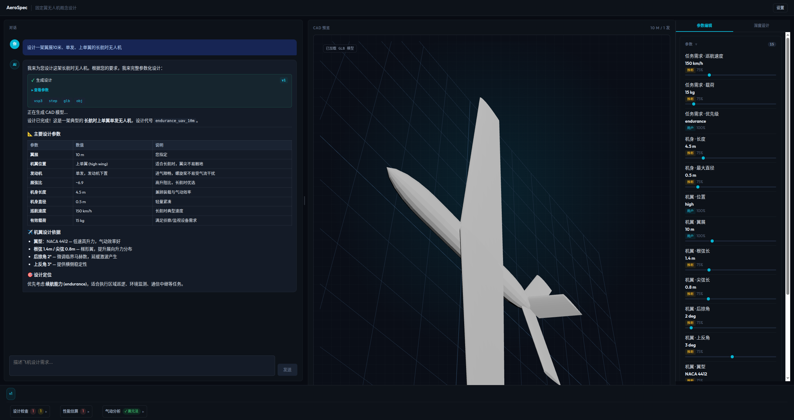
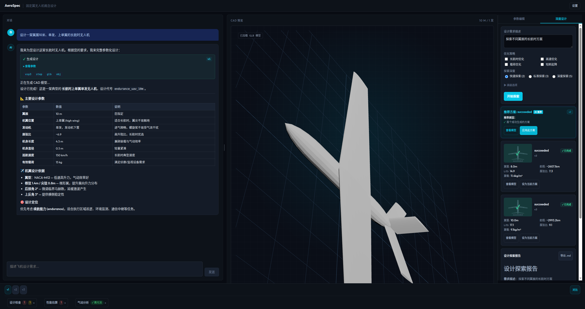

<div align="center">

# AeroSpec Agent

**Natural-language aircraft concept design workbench**

Describe an aircraft in plain language — get parametric CAD models, aerodynamic analysis, AI-driven design exploration, and an interactive 3D preview.

[](https://www.python.org/)
[](https://fastapi.tiangolo.com/)
[](https://nextjs.org/)
[](https://react.dev/)
[](https://threejs.org/)
[](https://langchain-ai.github.io/langgraph/)
[](https://docs.pydantic.dev/)
[](http://openvsp.org/)
[]()

[Report Bug](https://github.com/zweien/aero-spec-agent/issues) · [Request Feature](https://github.com/zweien/aero-spec-agent/issues) · [View Demo](#quick-start)

</div>

---

## Screenshots





---

## Features

### Conversational Design

Describe your aircraft in natural language. The LLM parses requirements into a structured `AircraftSpec`, calls OpenVSP to generate CAD, and streams results back with tool cards showing key parameters, file links, and generation status.

### AI Deep Design Exploration

Go beyond a single design. The **Deep Design** panel uses a LangGraph pipeline to automatically explore multiple design variants, compare aerodynamic metrics, and recommend the best option.

- Choose exploration depth (quick / standard / deep) and optimization strategies (endurance, speed, payload, STOL)
- Watch progress with a Chinese-labeled timeline (解析设计目标 → 生成候选方案 → 分析方案差异 → 生成设计建议)
- Review variant cards showing span, range, L/D ratio, aspect ratio, and wing loading
- Accept the AI-recommended variant or pick any variant — it becomes the current design instantly
- Export the full exploration report as Markdown

### Compare View

After generating multiple variants, use **Compare View** to compare up to 5 designs side by side. Add versions from the version panel or Deep Design variants, then view a structured comparison table with metrics (wingspan, L/D, range, aspect ratio, risk level, defaulted parameters). Best values are highlighted, and trust indicators flag designs with many system-defaulted parameters. Export comparison reports as Markdown with metric tables and confidence disclaimers.

### Interactive 3D Preview

Three.js viewer with GLB/OBJ model loading and a parameter-driven wireframe fallback. Orbit, zoom, and click to select aircraft parts for targeted modifications.

### Parametric CAD Generation

OpenVSP builds fuselage, wing, tail, and engine nacelles from the spec. Each generation exports `.vsp3`, `.step`, `.obj`, `.glb` artifacts per version.

### Aerodynamic Analysis

Optional VSPAERO panel-method sweep (CL/CD/CM vs alpha, optimal L/D, CL_alpha, CD0 estimate) with results in the bottom panel.

### Version History

Every generation creates an auto-incrementing version under the same design. Deep design variants append as new versions (v1 initial → v2 compact → v3 standard), giving a continuous iteration timeline.

### Live Parameter Editing

Drag sliders to tweak dimensions. Batch multiple changes and submit through the chat channel for a full re-generation with analysis.

### Runtime Settings

Switch between Fake/OpenVSP backends and toggle VSPAERO analysis from the UI — no restart needed.

## Architecture

```
┌──────────────────────────────────────────────────────────┐
│  Next.js Frontend (apps/web)                              │
│                                                           │
│  ChatPanel ─── natural language input, tool cards         │
│  CadViewer ─── Three.js 3D preview, part selection        │
│  ParameterPanel ── sliders for spec dimensions            │
│  DeepDesignPanel ── AI variant exploration + reports      │
│  VersionPanel ─── design rules, perf estimates, aero      │
│  SettingsPanel ─── backend toggle, VSPAERO switch         │
└───────────────────────┬──────────────────────────────────┘
                        │ HTTP / SSE
┌───────────────────────▼──────────────────────────────────┐
│  FastAPI Backend (services/api)                            │
│                                                           │
│  Chat Service ── LLM conversation, spec generation         │
│  LangGraph Pipeline ── intent routing, job orchestration   │
│  DeepDesignGraph ── variant generation + comparison        │
│  CompareGraph ── parallel VariantSubgraph execution        │
│  JobRunner ── synchronous generation, event bus            │
│  VersionStore ── thread-safe versioned storage             │
└───────────────────────┬──────────────────────────────────┘
                        │
┌───────────────────────▼──────────────────────────────────┐
│  CAD Worker (services/workers/cad_worker)                  │
│                                                           │
│  FakeCadBackend ── deterministic placeholders (testing)    │
│  OpenVspBackend ── OpenVSP 3.50.2 → STEP/OBJ/GLB         │
│  VSPAERO Analysis ── panel method aero sweep               │
│  Design Rules ── pass/warn/fail validation                 │
│  Performance Estimate ── range, L/D, wing loading, etc.    │
└───────────────────────────────────────────────────────────┘
```

### Key Data Flow

1. User types a description → ChatPanel sends to `/api/chat`
2. LLM generates `AircraftSpec` → backend creates design via `JobRunner.generate()`
3. CAD worker generates artifacts in `storage/designs/{id}/versions/{N}/`
4. Frontend polls job status, then loads GLB into CadViewer
5. **Deep design**: user fills exploration form → `/api/deep-design/stream` SSE → `DeepDesignGraph` runs variants → results stream back as timeline events
6. Variants append to the same design as new versions (v2, v3, ...)
7. "Set as current" loads variant into ParameterPanel + CadViewer seamlessly

## Quick Start

### Prerequisites

- Python 3.11+
- Node.js 18+
- An OpenAI-compatible LLM API key (DeepSeek, OpenAI, etc.)

### 1. Clone & Install

```bash
git clone https://github.com/zweien/aero-spec-agent.git
cd aero-spec-agent

# Backend
python -m venv .venv && . .venv/bin/activate
pip install -e ".[dev]"

# Frontend
cd apps/web && npm install && cd ../..
```

### 2. Configure

Create a `.env` file in the project root:

```bash
# LLM (required)
OPENAI_API_KEY=your-key-here
OPENAI_BASE_URL=https://api.deepseek.com   # or https://api.openai.com/v1
OPENAI_MODEL=deepseek-chat                  # or gpt-4o, etc.

# Server (optional, defaults shown)
API_HOST=0.0.0.0
API_PORT=8900
WEB_PORT=3900

# Generation mode
# sync is the default legacy path. Use async for real-time Agent Run browser QA.
CHAT_GENERATION_MODE=sync
```

### 3. Run

```bash
# Terminal 1 — Backend (fake CAD backend, no OpenVSP needed)
set -a && . ./.env && set +a
CAD_BACKEND=fake .venv/bin/python -m uvicorn services.api.app.main:app --host "$API_HOST" --port "$API_PORT"

# Terminal 2 — Frontend
cd apps/web
set -a && . ../../.env && set +a
npm run dev
```

Open http://localhost:3900 and start describing your aircraft.

### Recommended: Real-time Agent Run Mode

For the best experience with live CAD sub-stage streaming, use the async mode:

```bash
# Terminal 1 — Backend (async mode with visible stages)
set -a && . ./.env && set +a
CAD_BACKEND=fake CHAT_GENERATION_MODE=async FAKE_CAD_STEP_DELAY_MS=300 \
  .venv/bin/python -m uvicorn services.api.app.main:app --host "$API_HOST" --port "$API_PORT"

# Terminal 2 — Frontend (auto-loads .env.local)
cd apps/web && npm run dev
```

What you'll see:
1. Type an aircraft description → AI generates parameters in real-time
2. TaskRuntimeCard shows each CAD stage (机身→机翼→尾翼→发动机→导出)
3. CADLoadingOverlay shows progress in the 3D viewer
4. AgentRunActions: view model, deep design, export report, run details
5. Blue notice if any parameters were auto-filled with defaults

> `FAKE_CAD_STEP_DELAY_MS=300` slows each stage to 300ms for observation. Set to `0` for full speed.
> The legacy `sync` mode is still available as fallback but cannot stream CAD sub-stages.

See [Agent Run User Test Guide](docs/agent-run-user-test-guide.md) for detailed instructions.

### 4. Quick Demo

Seed three demo designs (long-endurance UAV, high-speed recon, heavy-lift cruiser) with one command:

```bash
# Make sure backend is running first (Terminal 1 from step 3)
CAD_BACKEND=fake .venv/bin/python scripts/seed_demo_designs.py
```

Then open http://localhost:3900 — the demo designs appear in the version panel with metrics, trust badges, and 3D previews. No LLM key needed for viewing seeded data.

> Demo designs carry a `demo-` ID prefix and are clearly labeled. They can coexist with normal designs.
> See [Demo Scenarios](docs/demo-scenarios.md) for details on each scenario.

### 5. Try Deep Design (Demo Flow)

Once the server is running:

1. Type a design request in the chat panel (e.g. "设计一架翼展10米、单发、上单翼的长航时无人机")
2. Wait for the initial design to generate and the 3D model to appear
3. Click the **深度设计** tab in the right panel
4. Describe what to explore, choose depth (快速 / 标准 / 深度), optionally check strategy tags
5. Click **开始探索** — watch the Chinese-labeled timeline progress
6. Review variant cards showing span, range, L/D ratio, wing loading
7. Accept the AI-recommended variant or pick any variant → it becomes the current design
8. Export the exploration report as Markdown

> **Disclaimer:** Deep Design results are for concept exploration only — not engineering design decisions.

### With Real OpenVSP

If you have [OpenVSP 3.50.2](http://openvsp.org/) with Python bindings installed:

```bash
# Check environment
.venv/bin/python scripts/check_openvsp_env.py

# Run with OpenVSP backend
CAD_BACKEND=openvsp .venv/bin/python -m uvicorn services.api.app.main:app --host "$API_HOST" --port "$API_PORT"
```

You can also switch backends at runtime from the Settings panel in the UI.

See [OpenVSP Environment Check](docs/openvsp-env-check.md) for detailed setup instructions and troubleshooting.

### Using Models Without Function Calling

Some local models (e.g., MiniMax-M2.5 on VLLM) may not support function calling / tool use. AeroSpec includes a **no-tool-call fallback** that uses rule-based intent detection to automatically identify design tasks from plain text responses.

The fallback is enabled by default and works transparently:
- When the LLM returns text without tool calls, the system checks if the message matches a design intent (generate, modify, or part-level change)
- If matched, it constructs tool arguments and routes through the same generation pipeline
- Concept questions, export commands, and other non-design requests are filtered out

To disable: `NO_TOOL_CALL_FALLBACK=false`

The fallback confidence threshold can be tuned via `NO_TOOL_CALL_FALLBACK_MIN_CONFIDENCE` (default: 0.6). See [No-Tool-Call Fallback QA](docs/no-tool-call-fallback-qa.md) for details.

## Usage

### Chat-driven Design

Type natural language in the chat panel:

> "设计一架翼展12米、双发、上单翼、常规尾翼的固定翼无人机"

The LLM generates a full `AircraftSpec`, calls OpenVSP, and shows the 3D model with a tool card.

### Deep Design Exploration

After generating an initial design:

1. Switch to the **深度设计** (Deep Design) tab in the right panel
2. Describe what to explore (e.g. "探索不同翼展的长航时方案")
3. Choose exploration depth and optimization strategies
4. Click **开始探索** — watch the timeline progress
5. Review variant cards with aerodynamic metrics
6. Click **应用此方案** to accept the recommended variant

Variants are stored as new versions under the same design, so you can always switch back.

### Parameter Editing

Drag sliders to adjust wing span, chord, sweep, etc. Changes are batched locally — click **确认修改** to submit through the chat, which triggers a full re-generation with analysis.

### Version History

Each generation creates a versioned directory:

```
storage/designs/{design_id}/
├── versions/
│   ├── 1/                    # Initial design from chat
│   │   ├── aircraft_spec.yaml
│   │   ├── aircraft.vsp3
│   │   ├── aircraft.step
│   │   ├── aircraft.obj
│   │   ├── aircraft.glb
│   │   ├── generation_log.json
│   │   └── validation_report.json
│   ├── 2/                    # Deep design variant (compact)
│   └── 3/                    # Deep design variant (standard)
```

## CAD Backends

| Backend | Purpose | Output | Notes |
|---------|---------|--------|-------|
| `fake` | Development and testing | Deterministic placeholder `.vsp3`, `.step`, `.obj`, `.glb` files | Fast, stable. Geometry is not physically generated by OpenVSP. |
| `openvsp` | Real CAD generation | OpenVSP-generated `.vsp3`, `.step`, `.obj`, `.glb` files | Requires OpenVSP Python bindings. Supports the geometry matrix below. |

`OPENVSP_ERROR_POLICY` controls how OpenVSP adapter errors are handled:

| Value | Behavior |
|-------|----------|
| `warn` | Default. Keep generation alive and record error details in metadata. |
| `fail` | Raise `CadGenerationError` — failed generations do not silently replace a usable version. |

### Supported Geometry Matrix

| Area | Supported | Not yet exposed |
|------|-----------|-----------------|
| Aircraft layout | Fixed-wing UAV | Multirotor, rotorcraft, blended-wing body |
| Wing position | `high`, `mid`, `low` | Custom multi-wing layouts |
| Tail type | `conventional` | `t-tail`, `v-tail` |
| Engine count | `1`, `2` | More than two engines |
| Engine position | `under_wing` | `on_fuselage`, `wing_tip`, `rear_fuselage` |
| Selectable parts | `part:fuselage`, `part:main_wing`, `part:tail`, `part:left_engine`, `part:right_engine` | Arbitrary OpenVSP sub-geometry |

## API Reference

### Core Endpoints

| Method | Endpoint | Description |
|--------|----------|-------------|
| `POST` | `/api/chat` | LLM chat with tool use (generate/modify design) |
| `POST` | `/api/designs/{id}/generate` | Generate CAD from YAML spec |
| `PATCH` | `/api/designs/{id}/spec` | Patch spec fields, triggers re-generation |
| `GET` | `/api/designs/{id}/versions` | List all version numbers |
| `GET` | `/api/designs/{id}/versions/{no}` | Get version metadata + validation report |
| `GET` | `/api/designs/{id}/versions/{no}/files/{name}` | Download artifact file |
| `GET` | `/api/jobs/{job_id}` | Poll job status |
| `GET` | `/health` | Health check |

### Deep Design Endpoints

| Method | Endpoint | Description |
|--------|----------|-------------|
| `POST` | `/api/deep-design/stream` | SSE stream for multi-variant exploration |
| `POST` | `/api/deep-design` | Synchronous deep design (non-streaming) |

### SSE Event Types (Deep Design Stream)

| Event | Description |
|-------|-------------|
| `graph_node` | Pipeline stage started/completed with latency |
| `generation_started` | Variant job started |
| `generation_complete` | Variant succeeded (includes `version_no`) |
| `generation_failed` | Variant failed |
| `message` | Final report content |

## Testing

```bash
# Backend tests — 548+ tests (fake backend, no OpenVSP needed)
CAD_BACKEND=fake .venv/bin/python -m pytest tests/ -q

# Frontend component tests — 159 tests
cd apps/web && npx tsx --test src/components/**/*.test.ts* && cd ../..

# Frontend production build
cd apps/web && npm run build && cd ../..

# OpenVSP integration tests (requires OpenVSP installed)
CAD_BACKEND=openvsp RUN_OPENVSP_TESTS=1 .venv/bin/python -m pytest tests/api/test_openvsp_integration.py -q

# Lint
.venv/bin/python -m ruff check .
```

## Current Verification Status

| Component | Status | Backend | Tests |
|-----------|--------|---------|-------|
| Fake CAD pipeline | Pass | fake | 548+ |
| OpenVSP env check | Script ready | N/A | -- |
| OpenVSP single/twin engine | Pass | openvsp | validate script |
| OpenVSP failure injection | Pass | fake | 12 |
| Variant trust / confidence | Pass | fake | 8 |
| DesignMetrics source/confidence | Pass | fake | 7 |
| DesignMetricsCard UI | Pass | any | manual |
| Compare View export | Pass | any | 7 |
| Demo seed script | Pass | fake | manual |
| Frontend build | Pass | -- | 159 |

Run `python scripts/summarize_qa_status.py` for detailed QA doc status.

## Tech Stack

| Layer | Technology |
|-------|-----------|
| Frontend | Next.js 14 · React · TypeScript |
| 3D Viewer | Three.js (GLB/OBJ loader, parameterized wireframe) |
| Backend | FastAPI · Pydantic · SSE |
| AI Pipeline | LangGraph (multi-variant exploration graph) |
| CAD Engine | OpenVSP 3.50.2 (Python API) |
| Aero Analysis | VSPAERO Panel Method |
| LLM | OpenAI-compatible API (DeepSeek / OpenAI) |

## Project Structure

```
aero-spec-agent/
├── apps/web/                          # Next.js frontend
│   └── src/
│       ├── app/
│       │   ├── page.tsx               # Main workbench layout
│       │   ├── globals.css            # Workspace + panel styles
│       │   └── api/chat/route.ts      # Chat API proxy
│       ├── components/
│       │   ├── cad-viewer/            # Three.js 3D preview
│       │   ├── chat/                  # Chat panel + SSE + job polling
│       │   ├── compare/               # Compare View + export + metrics
│       │   ├── metrics/               # DesignMetricsCard component
│       │   ├── graph/                 # Deep design exploration UI
│       │   │   ├── DeepDesignPanel    # Exploration form + results
│       │   │   ├── GraphTimeline      # Chinese-labeled progress
│       │   │   ├── RecommendedVariantCard  # AI recommendation
│       │   │   ├── VariantSummaryCard # Variant metrics display
│       │   │   ├── VariantThumbnail   # Aircraft silhouette SVG
│       │   │   └── useDeepDesignStream # SSE stream hook
│       │   ├── parameter-panel/       # Spec dimension sliders
│       │   ├── settings-panel/        # Backend + VSPAERO toggle
│       │   └── version-panel/         # Rules, estimates, aero data
│       └── lib/                       # generationFlow, jobDiagnostics
│
├── services/
│   ├── api/                           # FastAPI backend
│   │   └── app/
│   │       ├── main.py                # App entry, CORS, routers
│   │       ├── graph/                 # LangGraph pipelines
│   │       │   ├── deep_design_graph  # Multi-variant exploration
│   │       │   ├── compare_graph      # Parallel variant dispatch
│   │       │   ├── variant_subgraph   # Single variant generation
│   │       │   ├── design_graph       # Chat-driven design flow
│   │       │   ├── sse_adapter        # Event → SSE conversion
│   │       │   └── nodes/             # Graph node implementations
│   │       ├── routers/               # API endpoints
│   │       │   ├── chat.py            # /api/chat
│   │       │   ├── designs.py         # /api/designs/*
│   │       │   ├── deep_design.py     # /api/deep-design/stream
│   │       │   └── design_controller.py
│   │       ├── schemas/               # Pydantic models (AircraftSpec)
│   │       └── services/              # Business logic
│   │           ├── chat_service       # LLM conversation
│   │           ├── job_runner         # Synchronous CAD generation
│   │           ├── job_events         # EventBus for SSE streaming
│   │           ├── version_store      # Thread-safe versioned storage
│   │           └── spec_patch         # Spec field patching
│   └── workers/cad_worker/
│       └── openvsp_generator/
│           ├── generate_aircraft.py   # Orchestration
│           ├── backend_factory.py     # Fake/OpenVSP selection
│           ├── create_fuselage.py     # Fuselage geometry
│           ├── create_wing.py         # Wing geometry
│           ├── create_tail.py         # Tail geometry
│           ├── create_engine.py       # Engine nacelle geometry
│           ├── design_rules.py        # Pass/warn/fail validation
│           ├── performance_estimate.py # Range, L/D, wing loading
│           └── vspaero_analysis.py    # Panel method sweep
│
├── packages/aircraft-schema/          # Spec YAML definitions & examples
├── tests/api/                         # 548 backend tests
├── storage/                           # Generated design artifacts (gitignored)
└── pyproject.toml                     # Python project config
```

## License

This project is licensed under the MIT License — see the [LICENSE](LICENSE) file for details.

## Acknowledgments

- [OpenVSP](http://openvsp.org/) — Open Vehicle Sketch Pad by NASA
- [VSPAERO](http://openvsp.org/) — Panel-method aerodynamic analysis
- [Three.js](https://threejs.org/) — 3D graphics for the web
- [LangGraph](https://langchain-ai.github.io/langgraph/) — Stateful multi-actor AI pipelines

---

<div align="center">

**[Back to Top](#aerospec-agent)**

</div>
