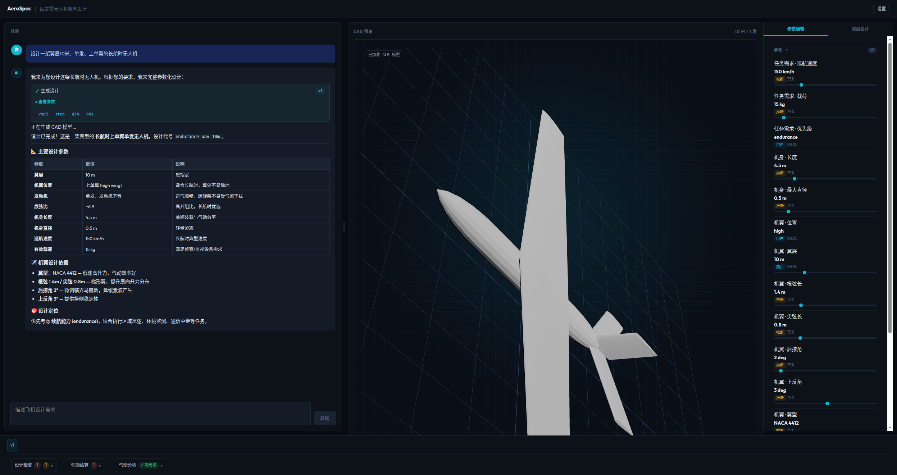
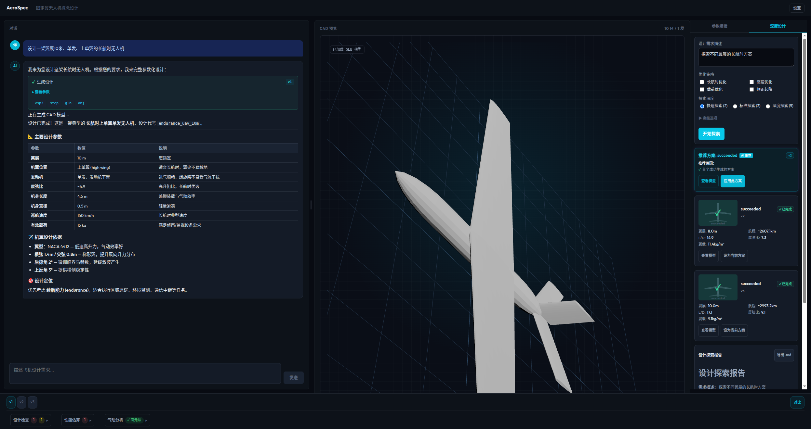

<div align="center">

# AeroSpec Agent

**自然语言飞行器概念设计工作台**

用自然语言描述飞行器 — 获得参数化 CAD 模型、气动分析、AI 驱动的设计探索和交互式 3D 预览。

[](https://www.python.org/)
[](https://fastapi.tiangolo.com/)
[](https://nextjs.org/)
[](https://react.dev/)
[](https://threejs.org/)
[](https://langchain-ai.github.io/langgraph/)
[](https://docs.pydantic.dev/)
[](http://openvsp.org/)
[]()

[English](./README.md) | 中文

[报告问题](https://github.com/zweien/aero-spec-agent/issues) · [功能建议](https://github.com/zweien/aero-spec-agent/issues) · [查看演示](#快速开始)

</div>

---

## 截图





---

## 功能特性

### 对话式设计

用自然语言描述你的飞行器。LLM 将需求解析为结构化的 `AircraftSpec`，调用 OpenVSP 生成 CAD，并通过工具卡片流式返回关键参数、文件链接和生成状态。

### AI 深度设计探索

超越单一设计。**深度设计**面板使用 LangGraph 管道自动探索多个设计变体，对比气动指标，并推荐最佳方案。

- 选择探索深度（快速 / 标准 / 深度）和优化策略（航时、速度、载荷、短距起降）
- 布局感知的变体生成：鸭翼布局变化 canard.span，双翼机布局变化 second_wing.gap 等
- 通过中文标注的时间线查看进度（解析设计目标 → 生成候选方案 → 分析方案差异 → 生成设计建议）
- 查看变体卡片，展示翼展、航程、升阻比、展弦比和翼载
- 接受 AI 推荐变体或选择任意变体 — 立即成为当前设计
- 将完整探索报告导出为 Markdown

### 对比视图

生成多个变体后，使用**对比视图**并排比较最多 5 个设计。从版本面板或深度设计变体中添加版本，查看包含指标（翼展、升阻比、航程、展弦比、风险等级、默认参数）的结构化对比表。最优值高亮显示，可信度指标标记具有大量系统默认参数的设计。可导出包含指标表和置信度说明的对比报告（Markdown 格式）。

### 交互式 3D 预览

Three.js 查看器，支持 GLB/OBJ 模型加载和参数化线框回退。轨道旋转、缩放、点击选择飞行器部件进行针对性修改。

### 参数化 CAD 生成

OpenVSP 根据规格构建机身、机翼、尾翼、发动机舱、鸭翼、尾撑、BWB 扁平体及其他布局特定部件。支持 11 种气动布局类型，采用布局感知的几何调度。每次生成导出 `.vsp3`、`.step`、`.obj`、`.glb` 工件。

### 气动分析

可选的 VSPAERO 面板法扫描（CL/CD/CM 随迎角变化、最优升阻比、CL_alpha、CD0 估算），结果显示在底部面板。多面分析根据布局包含所有气动面（例如鸭翼布局包含鸭翼 + 主翼）。

### 版本历史

每次生成在同一设计下创建自增版本。深度设计变体作为新版本追加（v1 初始 → v2 紧凑 → v3 标准），形成连续迭代时间线。

### 实时参数编辑

拖动滑块调整尺寸。批量修改后通过聊天通道提交，触发带分析的完整重新生成。

### 运行时设置

在 UI 中切换 Fake/OpenVSP 后端和 VSPAERO 分析开关 — 无需重启。

## 系统架构

```
┌──────────────────────────────────────────────────────────┐
│  Next.js 前端 (apps/web)                                  │
│                                                           │
│  ChatPanel ─── 自然语言输入，工具卡片                       │
│  CadViewer ─── Three.js 3D 预览，部件选择                  │
│  ParameterPanel ── 规格尺寸滑块                            │
│  DeepDesignPanel ── AI 变体探索 + 报告                     │
│  VersionPanel ─── 设计规则、性能估算、气动数据               │
│  SettingsPanel ─── 后端切换，VSPAERO 开关                   │
└───────────────────────┬──────────────────────────────────┘
                        │ HTTP / SSE
┌───────────────────────▼──────────────────────────────────┐
│  FastAPI 后端 (services/api)                               │
│                                                           │
│  Chat Service ── LLM 对话，规格生成                         │
│  LangGraph Pipeline ── 意图路由，任务编排                    │
│  DeepDesignGraph ── 变体生成 + 对比                         │
│  CompareGraph ── 并行 VariantSubgraph 执行                  │
│  JobRunner ── 同步生成，事件总线                             │
│  VersionStore ── 线程安全的版本化存储                        │
└───────────────────────┬──────────────────────────────────┘
                        │
┌───────────────────────▼──────────────────────────────────┐
│  CAD Worker (services/workers/cad_worker)                  │
│                                                           │
│  FakeCadBackend ── 确定性占位文件（测试用）                   │
│  OpenVspBackend ── OpenVSP 3.50.2 → STEP/OBJ/GLB         │
│  VSPAERO Analysis ── 面板法气动扫描                         │
│  Design Rules ── 通过/警告/失败验证                         │
│  Performance Estimate ── 航程、升阻比、翼载等                │
└───────────────────────────────────────────────────────────┘
```

### 核心数据流

1. 用户输入描述 → ChatPanel 发送至 `/api/chat`
2. LLM 生成 `AircraftSpec` → 后端通过 `JobRunner.generate()` 创建设计
3. CAD Worker 在 `storage/designs/{id}/versions/{N}/` 中生成工件
4. 前端轮询任务状态，然后将 GLB 加载到 CadViewer
5. **深度设计**：用户填写探索表单 → `/api/deep-design/stream` SSE → `DeepDesignGraph` 运行变体 → 结果以时间线事件流式返回
6. 变体作为新版本追加到同一设计（v2、v3...）
7. "设为当前"将变体无缝加载到 ParameterPanel + CadViewer

## 快速开始

### 前置要求

- Python 3.11+
- Node.js 18+
- OpenAI 兼容的 LLM API 密钥（DeepSeek、OpenAI 等）

### 1. 克隆与安装

```bash
git clone https://github.com/zweien/aero-spec-agent.git
cd aero-spec-agent

# 后端
python -m venv .venv && . .venv/bin/activate
pip install -e ".[dev]"

# 前端
cd apps/web && npm install && cd ../..
```

### 2. 配置

在项目根目录创建 `.env` 文件：

```bash
# LLM（必填）
OPENAI_API_KEY=your-key-here
OPENAI_BASE_URL=https://api.deepseek.com   # 或 https://api.openai.com/v1
OPENAI_MODEL=deepseek-chat                  # 或 gpt-4o 等

# 服务器（可选，以下为默认值）
API_HOST=0.0.0.0
API_PORT=8900
WEB_PORT=3900

# 生成模式
# sync 为默认的传统路径。使用 async 可获得实时 Agent Run 浏览器 QA 体验。
CHAT_GENERATION_MODE=sync
```

### 3. 运行

```bash
# 终端 1 — 后端（fake CAD 后端，无需 OpenVSP）
set -a && . ./.env && set +a
CAD_BACKEND=fake .venv/bin/python -m uvicorn services.api.app.main:app --host "$API_HOST" --port "$API_PORT"

# 终端 2 — 前端
cd apps/web
set -a && . ../../.env && set +a
npm run dev
```

打开 http://localhost:3900，开始描述你的飞行器。

### 推荐：实时 Agent Run 模式

获得带 CAD 子阶段实时流式传输的最佳体验，请使用异步模式：

```bash
# 终端 1 — 后端（异步模式，可见阶段）
set -a && . ./.env && set +a
CAD_BACKEND=fake CHAT_GENERATION_MODE=async FAKE_CAD_STEP_DELAY_MS=300 \
  .venv/bin/python -m uvicorn services.api.app.main:app --host "$API_HOST" --port "$API_PORT"

# 终端 2 — 前端（自动加载 .env.local）
cd apps/web && npm run dev
```

你将看到：
1. 输入飞行器描述 → AI 实时生成参数
2. TaskRuntimeCard 显示每个 CAD 阶段（机身→机翼→尾翼→发动机→导出）
3. CADLoadingOverlay 在 3D 查看器中显示进度
4. AgentRunActions：查看模型、深度设计、导出报告、运行详情
5. 如有参数自动填充默认值，显示蓝色提示

> `FAKE_CAD_STEP_DELAY_MS=300` 将每个阶段放慢到 300ms 以便观察。设为 `0` 可全速运行。
> 传统 `sync` 模式仍可作为回退使用，但无法流式传输 CAD 子阶段。

详见 [Agent Run 用户测试指南](docs/agent-run-user-test-guide.md)。

### 4. 快速演示

一条命令生成三个演示设计（长航时无人机、高速侦察机、重型运输机）：

```bash
# 确保后端已运行（第 3 步的终端 1）
CAD_BACKEND=fake .venv/bin/python scripts/seed_demo_designs.py
```

然后打开 http://localhost:3900 — 演示设计出现在版本面板中，包含指标、可信度徽章和 3D 预览。查看已填充数据不需要 LLM 密钥。

> 演示设计带有 `demo-` ID 前缀并明确标注。可与正常设计共存。
> 各场景详情请见 [演示场景](docs/demo-scenarios.md)。

### 5. 体验深度设计（演示流程）

服务运行后：

1. 在聊天面板中输入设计请求（如"设计一架翼展10米、单发、上单翼的长航时无人机"）
2. 等待初始设计生成，3D 模型出现
3. 点击右侧面板的 **深度设计** 标签
4. 描述探索方向，选择深度（快速 / 标准 / 深度），可选勾选策略标签
5. 点击 **开始探索** — 观察中文时间线进度
6. 查看变体卡片，展示翼展、航程、升阻比、翼载
7. 接受 AI 推荐变体或选择任意变体 → 成为当前设计
8. 将探索报告导出为 Markdown

> **声明：** 深度设计结果仅用于概念探索，不作为工程设计决策依据。

### 使用真实 OpenVSP

如已安装带 Python 绑定的 [OpenVSP 3.50.2](http://openvsp.org/)：

```bash
# 检查环境
.venv/bin/python scripts/check_openvsp_env.py

# 使用 OpenVSP 后端运行
CAD_BACKEND=openvsp .venv/bin/python -m uvicorn services.api.app.main:app --host "$API_HOST" --port "$API_PORT"
```

也可以在 UI 的设置面板中运行时切换后端。

详见 [OpenVSP 环境检查](docs/openvsp-env-check.md) 获取详细安装说明和故障排除。

### 使用不支持函数调用的模型

某些本地模型（如 VLLM 上的 MiniMax-M2.5）可能不支持函数调用 / 工具使用。AeroSpec 包含**无工具调用回退**机制，使用基于规则的意图检测自动从纯文本响应中识别设计任务。

回退默认启用，透明工作：
- 当 LLM 返回不含工具调用的文本时，系统检查消息是否匹配设计意图（生成、修改或部件级变更）
- 如匹配，构造工具参数并通过相同生成管道路由
- 概念问题、导出命令和其他非设计请求被过滤

禁用方式：`NO_TOOL_CALL_FALLBACK=false`

回退置信度阈值可通过 `NO_TOOL_CALL_FALLBACK_MIN_CONFIDENCE` 调整（默认 0.6）。详见 [无工具调用回退 QA](docs/no-tool-call-fallback-qa.md)。

## 使用指南

### 对话驱动设计

在聊天面板中输入自然语言：

> "设计一架翼展12米、双发、上单翼、常规尾翼的固定翼无人机"

LLM 生成完整的 `AircraftSpec`，调用 OpenVSP，并通过工具卡片展示 3D 模型。

### 设计提示词示例

以下是覆盖全部 11 种支持的气动布局的示例提示词。复制任意一条到聊天面板即可生成设计。

**常规布局 (Conventional)**
> 设计一架翼展10米、单发、上单翼、常规尾翼的长航时侦察无人机，巡航速度150km/h

> 一架双发中单翼运输无人机，翼展14米，载荷50kg，V尾

**双尾撑 (Twin Boom)**
> 设计一架双尾撑推进式无人机，翼展6米，尾推发动机，用于航拍测绘

> 一架双尾撑侦察无人机，翼展4米，单发推进，巡航速度120km/h

**飞翼 (Flying Wing)**
> 设计一架飞翼布局无人机，翼展5米，单发，用于隐身侦察

> 一架飞翼无人机，翼展8米，双发，三角翼，巡航速度200km/h

**翼身融合 (Blended Wing Body)**
> 设计一架翼身融合布局无人机，翼展12米，单发，用于长航时巡逻

> 一架BWB运输无人机，翼展15米，双发，载荷100kg

**鸭翼布局 (Canard)**
> 设计一架鸭翼布局无人机，翼展8米，单发，上单翼，用于高速侦察

> 一架鸭翼气动布局无人机，翼展6米，双发，巡航速度180km/h

**三翼面 (Three Surface)**
> 设计一架三翼面布局无人机，翼展10米，单发，兼具鸭翼和常规尾翼，用于高机动任务

**串列翼 (Tandem Wing)**
> 设计一架串列翼布局无人机，翼展5米，单发，用于短距起降运输

> 一架串列翼无人机，前后翼布局，翼展4米，载荷20kg

**双翼机 (Biplane)**
> 设计一架双翼机布局无人机，翼展6米，单发，用于低速航拍和农业巡查

> 一架双翼无人机，翼展4米，层翼间距1米，巡航速度80km/h

**连接翼 (Joined Wing)**
> 设计一架连接翼布局无人机，翼展7米，单发，前后翼在翼尖连接，用于长航时监控

**箱式翼 (Box Wing)**
> 设计一架箱式翼布局无人机，翼展8米，单发，上下翼通过端板连接，高升力运输

**双机身 (Multi-Fuselage)**
> 设计一架双机身布局无人机，翼展16米，双发，用于大载荷远程运输

---

生成后还可以修改已有设计：

> 把机翼后掠角改成25度
> 机身加长2米
> 把右发动机往外移0.5米
> 改成V尾

### 深度设计探索

生成初始设计后：

1. 切换到右侧面板的 **深度设计** 标签
2. 描述探索方向（如"探索不同翼展的长航时方案"）
3. 选择探索深度和优化策略
4. 点击 **开始探索** — 观察时间线进度
5. 查看含气动指标的变体卡片
6. 点击 **应用此方案** 接受推荐变体

变体作为新版本存储在同一设计下，可随时切换回去。

### 参数编辑

拖动滑块调整翼展、弦长、后掠角等。修改在本地批量缓存 — 点击 **确认修改** 通过聊天提交，触发带分析的完整重新生成。

### 版本历史

每次生成创建版本化目录：

```
storage/designs/{design_id}/
├── versions/
│   ├── 1/                    # 聊天生成的初始设计
│   │   ├── aircraft_spec.yaml
│   │   ├── aircraft.vsp3
│   │   ├── aircraft.step
│   │   ├── aircraft.obj
│   │   ├── aircraft.glb
│   │   ├── generation_log.json
│   │   └── validation_report.json
│   ├── 2/                    # 深度设计变体（紧凑）
│   └── 3/                    # 深度设计变体（标准）
```

## CAD 后端

| 后端 | 用途 | 输出 | 说明 |
|------|------|------|------|
| `fake` | 开发和测试 | 确定性占位 `.vsp3`、`.step`、`.obj`、`.glb` 文件 | 快速、稳定。几何并非由 OpenVSP 物理生成。 |
| `openvsp` | 真实 CAD 生成 | OpenVSP 生成的 `.vsp3`、`.step`、`.obj`、`.glb` 文件 | 需要 OpenVSP Python 绑定。支持以下几何矩阵。 |

`OPENVSP_ERROR_POLICY` 控制 OpenVSP 适配器错误的处理方式：

| 值 | 行为 |
|----|------|
| `warn` | 默认。保持生成活跃并在元数据中记录错误详情。 |
| `fail` | 抛出 `CadGenerationError` — 失败的生成不会静默替换可用版本。 |

### 支持的几何矩阵

#### 气动布局

> **注意：** 这些布局用于概念设计和几何探索，不代表经过工程验证的构型。VSPAERO 的气动分析结果为近似值（面板法），不应作为设计决策的依据。各布局成熟度详情请见 [布局成熟度矩阵](docs/layout-maturity-matrix.md)。

AeroSpec Agent 通过规格中的 `aircraft.layout` 支持 11 种气动布局类型：

| 布局 | 部件 | 管道 | 真实 OpenVSP | 额外规格字段 | 示例规格 |
|------|------|:---:|:---:|------|------|
| `conventional` | 机身 + 机翼 + 尾翼 + 发动机 | ✅ | ✅ | — | `twin_engine_uav.yaml` |
| `twin_boom` | 机身 + 机翼 + 尾翼 + 发动机 + 尾撑 | ✅ | ✅ | `boom: Boom` | `twin_boom_pusher_uav.yaml` |
| `flying_wing` | 机翼 + 发动机（无机身、无尾翼） | ✅ | ✅ | — | `flying_wing_uav.yaml` |
| `blended_wing_body` | 扁平体 + 机翼 + 发动机 | ✅ | ✅ | `body: Body` | `bwb_uav.yaml` |
| `canard` | 机身 + 机翼 + 尾翼 + 发动机 + 鸭翼 | ✅ | ✅ | `canard: Canard` | `canard_uav.yaml` |
| `three_surface` | 机身 + 机翼 + 尾翼 + 发动机 + 鸭翼 | ✅ | ✅ | `canard: Canard` | `three_surface_uav.yaml` |
| `tandem_wing` | 机身 + 机翼 + 后翼 + 发动机 | ✅ | ✅ | `rear_wing: RearWing` | `tandem_wing_uav.yaml` |
| `biplane` | 机身 + 机翼 + 下翼 + 尾翼 + 发动机 | ✅ | ✅ | `second_wing: SecondWing` | `biplane_uav.yaml` |
| `joined_wing` | 机身 + 机翼 + 后翼（前掠）+ 尾翼 + 发动机 | ✅ | ✅ | `rear_wing: RearWing` | `joined_wing_uav.yaml` |
| `box_wing` | 机身 + 机翼 + 下翼 + 端板 + 尾翼 + 发动机 | ✅ | ✅ | `box_wing_config: BoxWingConfig` | `box_wing_uav.yaml` |
| `multi_fuselage` | 2× 机身 + 机翼 + 尾翼 + 发动机 | ✅ | ✅ | `multi_fuselage: MultiFuselageConfig` | `multi_fuselage_uav.yaml` |

**管道 ✅** = 软件管道可靠生成工件。**真实 OpenVSP ✅** = 真实 OpenVSP 3.50.2 验证生成非零 vsp3/glb/step 工件。两者均不表示工程验证。详见 [布局成熟度矩阵](docs/layout-maturity-matrix.md)、[Fake QA](docs/layout-openvsp-qa.md)、[真实 OpenVSP QA](docs/layout-openvsp-real-qa.md) 和 [视觉 QA](docs/layout-visual-qa.md)。

布局感知调度自动创建或跳过几何部件：

| 部件 | 常规 | 双尾撑 | 飞翼 | BWB | 鸭翼 | 三翼面 | 串列翼 | 双翼机 | 连接翼 | 箱式翼 | 双机身 |
|------|:---:|:---:|:---:|:---:|:---:|:---:|:---:|:---:|:---:|:---:|:---:|
| 机身 | ✅ | ✅ | — | — | ✅ | ✅ | ✅ | ✅ | ✅ | ✅ | 2× |
| 扁平体 | — | — | — | ✅ | — | — | — | — | — | — | — |
| 尾翼面 | ✅ | ✅ | — | — | ✅ | ✅ | — | ✅ | ✅ | ✅ | ✅ |
| 主翼 | ✅ | ✅ | ✅ | ✅ | ✅ | ✅ | ✅ | ✅ | ✅ | ✅ | ✅ |
| 鸭翼 | — | — | — | — | ✅ | ✅ | — | — | — | — | — |
| 后翼 | — | — | — | — | — | — | ✅ | — | ✅ | — | — |
| 下翼/副翼 | — | — | — | — | — | — | — | ✅ | — | ✅ | — |
| 尾撑 | — | ✅ | — | — | — | — | — | — | — | — | — |
| 端板 | — | — | — | — | — | — | — | — | — | ✅ | — |
| 发动机舱 | ✅ | ✅ | ✅ | ✅ | ✅ | ✅ | ✅ | ✅ | ✅ | ✅ | ✅ |

#### 尾翼构型

| 类型 | 翼面 | 说明 |
|------|------|------|
| `conventional` | 水平尾翼 + 垂直尾翼 | 标准 H+V 尾翼 |
| `t_tail` | 垂直尾翼 + 水平尾翼（高位） | 水平安定面置于垂尾顶部 |
| `v_tail` | 1 个翼面，+45°（OpenVSP 自动镜像） | V 尾，兼顾俯仰和偏航控制 |
| `inverted_v` | 1 个翼面，-45°（自动镜像） | 倒 V 尾 |
| `cruciform` | 垂直尾翼 + 中高位水平尾翼 | 水平安定面安装在垂尾中部 |

#### 发动机构型

| 数量 | 布局 | 位置 |
|-----:|------|------|
| 1 | 中心 | `nose`、`tail`、`rear_fuselage`、`pusher`、`under_wing` |
| 2 | 对称对 | `under_wing`、`wing_tip`、`over_wing` |
| 3 | 中心 + 对称对 | 相同基础位置，中心在 Y=0 |
| 4 | 内侧 + 外侧对称对 | 内侧 18% 展向，外侧 38% 展向 |

所有发动机支持可选 XYZ 偏移（`engine.x_offset`、`engine.y_offset`、`engine.z_offset`）用于微调发动机舱位置。还提供 `push_pull` 和 `over_wing` 额外位置。

#### 多段机翼

| 段数 | 结果 |
|-----:|------|
| 1 | 单一 WING 几何（默认） |
| 2 | `inner_wing` + `outer_wing`，独立后掠角/上反角 |
| 3 | `inner_wing` + `mid_wing` + `outer_wing` |

多段机翼允许内外翼段具有不同的后掠角和上反角，通过 `wing.inner_sweep` 和 `wing.inner_dihedral` 控制。

#### 完整参数矩阵

| 领域 | 支持项 |
|------|--------|
| 飞行器布局 | `conventional`、`twin_boom`、`flying_wing`、`blended_wing_body`、`canard`、`three_surface`、`tandem_wing`、`biplane`、`joined_wing`、`box_wing`、`multi_fuselage` |
| 机翼位置 | `high`、`mid`、`low` |
| 机翼平面形状 | `conventional`、`delta`、`ogee` |
| 机翼段数 | 1（单段）、2（内+外）、3（内+中+外） |
| 尾翼类型 | `conventional`、`t_tail`、`v_tail`、`inverted_v`、`cruciform` |
| 发动机数量 | 1、2、3、4 |
| 发动机位置 | `nose`、`tail`、`rear_fuselage`、`under_wing`、`wing_tip`、`over_wing`、`pusher`、`push_pull` |
| 任务优先级 | `endurance`、`speed`、`payload`、`range` |

## API 参考

### 核心端点

| 方法 | 端点 | 说明 |
|------|------|------|
| `POST` | `/api/chat` | LLM 聊天，带工具调用（生成/修改设计） |
| `POST` | `/api/designs/{id}/generate` | 从 YAML 规格生成 CAD |
| `PATCH` | `/api/designs/{id}/spec` | 补丁规格字段，触发重新生成 |
| `GET` | `/api/designs/{id}/versions` | 列出所有版本号 |
| `GET` | `/api/designs/{id}/versions/{no}` | 获取版本元数据 + 验证报告 |
| `GET` | `/api/designs/{id}/versions/{no}/files/{name}` | 下载工件文件 |
| `GET` | `/api/jobs/{job_id}` | 轮询任务状态 |
| `GET` | `/health` | 健康检查 |

### 深度设计端点

| 方法 | 端点 | 说明 |
|------|------|------|
| `POST` | `/api/deep-design/stream` | SSE 流式多变体探索 |
| `POST` | `/api/deep-design` | 同步深度设计（非流式） |

### SSE 事件类型（深度设计流）

| 事件 | 说明 |
|------|------|
| `graph_node` | 管道阶段开始/完成，含延迟 |
| `generation_started` | 变体任务开始 |
| `generation_complete` | 变体成功（含 `version_no`） |
| `generation_failed` | 变体失败 |
| `message` | 最终报告内容 |

## 测试

```bash
# 后端测试 — 654+ 测试（fake 后端，无需 OpenVSP）
CAD_BACKEND=fake .venv/bin/python -m pytest tests/ -q

# 前端组件测试 — 159 测试
cd apps/web && npx tsx --test src/components/**/*.test.ts* && cd ../..

# 前端生产构建
cd apps/web && npm run build && cd ../..

# OpenVSP 集成测试（需要安装 OpenVSP）
CAD_BACKEND=openvsp RUN_OPENVSP_TESTS=1 .venv/bin/python -m pytest tests/api/test_openvsp_integration.py -q

# 11 布局 QA — fake 后端（验证管道结构）
.venv/bin/python scripts/validate_layout_matrix.py --backend fake

# 11 布局 QA — 真实 OpenVSP（验证真实几何生成）
.venv/bin/python scripts/validate_layout_matrix.py --backend openvsp --output docs/layout-openvsp-real-qa.md

# 代码检查
.venv/bin/python -m ruff check .
```

**Fake QA vs 真实 OpenVSP QA：** Fake QA 验证软件管道能加载规格、应用默认值并生成工件。真实 OpenVSP QA 验证实际 OpenVSP 3.50.2 生成几何有效的 vsp3/glb/step 文件且非零大小。两者均不验证工程正确性。

## 当前验证状态

| 组件 | 状态 | 后端 | 测试 |
|------|------|------|------|
| Fake CAD 管道 | 通过 | fake | 654+ |
| OpenVSP 环境检查 | 脚本就绪 | N/A | — |
| OpenVSP 全 11 布局 | 通过 | openvsp | E2E（8 测试） |
| 布局 QA 验证（11 布局） | 通过 | fake/openvsp | 脚本 |
| 前端 2D 预览（全 11 布局） | 通过 | — | 手动 |
| Chat→Minimax LLM→OpenVSP E2E | 通过 | openvsp | 浏览器 |
| OpenVSP 故障注入 | 通过 | fake | 12 |
| VSPAERO 多面分析 | 通过 | fake | 29 |
| 深度设计布局感知策略 | 通过 | fake | 16 |
| 变体可信度/置信度 | 通过 | fake | 8 |
| DesignMetrics 来源/置信度 | 通过 | fake | 7 |
| DesignMetricsCard UI | 通过 | any | 手动 |
| 对比视图导出 | 通过 | any | 7 |
| 演示填充脚本 | 通过 | fake | 手动 |
| 前端构建 | 通过 | — | 159 |
| V 尾 / inverted_v / 十字形 | 通过 | fake | 6 |
| 多段机翼（1-3） | 通过 | fake | 8 |
| 3-4 发动机构型 | 通过 | fake | 5 |

运行 `python scripts/summarize_qa_status.py` 查看详细 QA 文档状态。

## 技术栈

| 层级 | 技术 |
|------|------|
| 前端 | Next.js 14 · React · TypeScript |
| 3D 查看器 | Three.js（GLB/OBJ 加载器，参数化线框） |
| 后端 | FastAPI · Pydantic · SSE |
| AI 管道 | LangGraph（多变体探索图） |
| CAD 引擎 | OpenVSP 3.50.2（Python API） |
| 气动分析 | VSPAERO 面板法 |
| LLM | OpenAI 兼容 API（DeepSeek / OpenAI） |

## 项目结构

```
aero-spec-agent/
├── apps/web/                          # Next.js 前端
│   └── src/
│       ├── app/
│       │   ├── page.tsx               # 主工作台布局
│       │   ├── globals.css            # 工作区 + 面板样式
│       │   └── api/chat/route.ts      # 聊天 API 代理
│       ├── components/
│       │   ├── cad-viewer/            # Three.js 3D 预览
│       │   ├── chat/                  # 聊天面板 + SSE + 任务轮询
│       │   ├── compare/               # 对比视图 + 导出 + 指标
│       │   ├── metrics/               # DesignMetricsCard 组件
│       │   ├── graph/                 # 深度设计探索 UI
│       │   │   ├── DeepDesignPanel    # 探索表单 + 结果
│       │   │   ├── GraphTimeline      # 中文标注进度
│       │   │   ├── RecommendedVariantCard  # AI 推荐
│       │   │   ├── VariantSummaryCard # 变体指标展示
│       │   │   ├── VariantThumbnail   # 飞行器剪影 SVG
│       │   │   └── useDeepDesignStream # SSE 流 hook
│       │   ├── parameter-panel/       # 规格尺寸滑块
│       │   ├── settings-panel/        # 后端 + VSPAERO 切换
│       │   └── version-panel/         # 规则、估算、气动数据
│       └── lib/                       # generationFlow、jobDiagnostics
│
├── services/
│   ├── api/                           # FastAPI 后端
│   │   └── app/
│   │       ├── main.py                # 应用入口，CORS，路由
│   │       ├── graph/                 # LangGraph 管道
│   │       │   ├── deep_design_graph  # 多变体探索
│   │       │   ├── compare_graph      # 并行变体调度
│   │       │   ├── variant_subgraph   # 单变体生成
│   │       │   ├── design_graph       # 聊天驱动设计流
│   │       │   ├── sse_adapter        # 事件 → SSE 转换
│   │       │   └── nodes/             # 图节点实现
│   │       ├── routers/               # API 端点
│   │       │   ├── chat.py            # /api/chat
│   │       │   ├── designs.py         # /api/designs/*
│   │       │   ├── deep_design.py     # /api/deep-design/stream
│   │       │   └── design_controller.py
│   │       ├── schemas/               # Pydantic 模型（AircraftSpec）
│   │       └── services/              # 业务逻辑
│   │           ├── chat_service       # LLM 对话
│   │           ├── job_runner         # 同步 CAD 生成
│   │           ├── job_events         # SSE 流事件总线
│   │           ├── version_store      # 线程安全版本化存储
│   │           └── spec_patch         # 规格字段补丁
│   └── workers/cad_worker/
│       └── openvsp_generator/
│           ├── generate_aircraft.py   # 编排
│           ├── backend_factory.py     # Fake/OpenVSP 选择
│           ├── create_fuselage.py     # 机身几何
│           ├── create_wing.py         # 机翼几何（单段/多段）
│           ├── create_tail.py         # 尾翼几何（5 种类型）
│           ├── create_engine.py       # 发动机舱几何（1-4 台）
│           ├── create_boom.py         # 双尾撑几何
│           ├── create_body.py         # BWB 扁平体几何
│           ├── create_canard.py       # 鸭翼几何
│           ├── create_tandem_wing.py  # 串列翼/连接翼几何
│           ├── create_biplane.py      # 双翼机下翼几何
│           ├── create_box_wing.py     # 箱式翼下翼 + 端板
│           ├── create_multi_fuselage.py # 双机身几何
│           ├── design_rules.py        # 通过/警告/失败验证
│           ├── performance_estimate.py # 航程、升阻比、翼载
│           └── vspaero_analysis.py    # 面板法扫描
│
├── packages/aircraft-schema/          # 规格 YAML 定义 & 示例
├── tests/api/                         # 654 后端测试
├── storage/                           # 生成的设计工件（gitignored）
└── pyproject.toml                     # Python 项目配置
```

## 许可证

本项目基于 **MIT 许可证** 授权。

### 第三方依赖

第三方依赖受其各自许可证约束，而非本项目的 MIT 许可证：

| 依赖 | 许可证 | 说明 |
|------|--------|------|
| [OpenVSP](http://openvsp.org/) | **NOSA-1.3**（NASA 开源协议 v1.3） | 可选外部依赖。不随本项目分发。用户需单独安装并遵守 NOSA-1.3。 |
| Python 包 (pip) | MIT、Apache-2.0、BSD、PSF、MPL-2.0、LGPL-3.0 | ~70 个包。完整列表见 [THIRD_PARTY_NOTICES.md](THIRD_PARTY_NOTICES.md)。 |
| NPM 包 (Node.js) | MIT、Apache-2.0、ISC、BSD-3-Clause、CC-BY-4.0 | ~150 个包。完整列表见 [THIRD_PARTY_NOTICES.md](THIRD_PARTY_NOTICES.md)。 |

完整依赖许可证报告：[THIRD_PARTY_NOTICES.md](THIRD_PARTY_NOTICES.md)

### 免责声明

本项目为独立的社区努力。未经 NASA、OpenVSP、Vercel、OpenAI、LangChain、Meta 或任何其他上游项目认可、赞助或认证。产品名称和标识为其各自所有者的财产。

## 致谢

- [OpenVSP](http://openvsp.org/) — NASA 开源飞行器草图板
- [VSPAERO](http://openvsp.org/) — 面板法气动分析
- [Three.js](https://threejs.org/) — Web 3D 图形库
- [LangGraph](https://langchain-ai.github.io/langgraph/) — 有状态多角色 AI 管道

---

<div align="center">

**[回到顶部](#aerospec-agent)**

</div>
