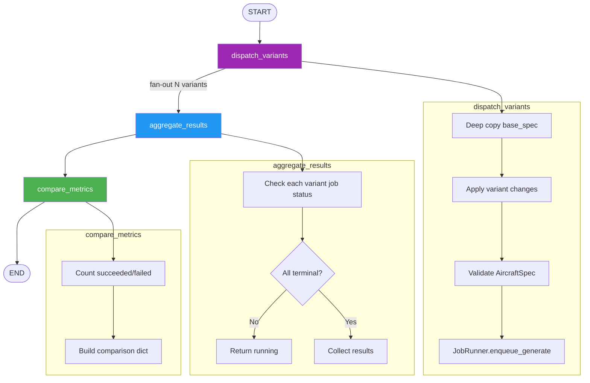

# CompareGraph Architecture


```mermaid
flowchart TD
    START([START]) --> DV[dispatch_variants]
    DV -->|fan-out N variants| AR[aggregate_results]
    AR --> CM[compare_metrics]
    CM --> END([END])

    subgraph "dispatch_variants"
        DV1[Deep copy base_spec] --> DV2[Apply variant changes]
        DV2 --> DV3[Validate AircraftSpec]
        DV3 --> DV4[JobRunner.enqueue_generate]
    end

    subgraph "aggregate_results"
        AR1[Check each variant job status] --> AR2{All terminal?}
        AR2 -->|No| AR3[Return running]
        AR2 -->|Yes| AR4[Collect results]
    end

    subgraph "compare_metrics"
        CM1[Count succeeded/failed] --> CM2[Build comparison dict]
    end

    DV --> DV1
    AR --> AR1
    CM --> CM1

    style DV fill:#9C27B0,color:#fff
    style AR fill:#2196F3,color:#fff
    style CM fill:#4CAF50,color:#fff
```

## Rendering

```bash
npx @mermaid-js/mermaid-cli -i docs/architecture/compare-graph.md -o docs/architecture/compare-graph.png
```
