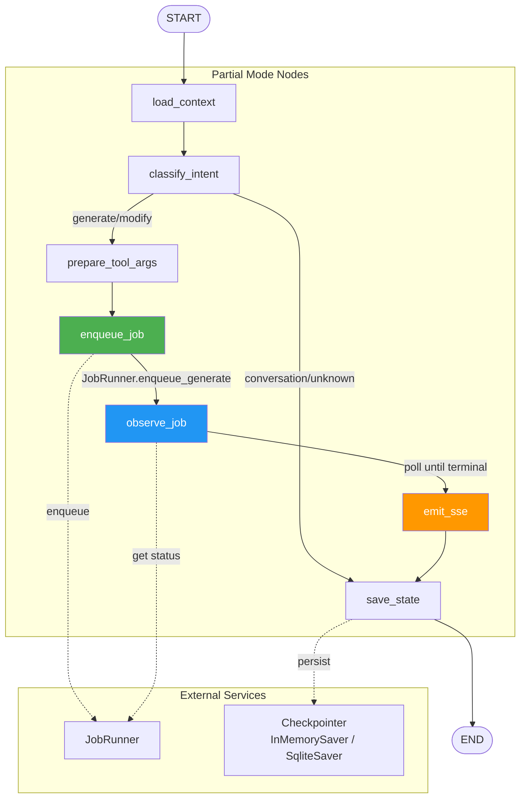

# LangGraph Partial Mode Architecture


```mermaid
flowchart TD
    START([START]) --> LC[load_context]
    LC --> CI[classify_intent]

    CI -->|generate/modify| PTA[prepare_tool_args]
    CI -->|conversation/unknown| SS[save_state]

    PTA --> EJ[enqueue_job]
    EJ -->|JobRunner.enqueue_generate| OJ[observe_job]
    OJ -->|poll until terminal| ES[emit_sse]
    ES --> SS

    SS --> END([END])

    subgraph "Partial Mode Nodes"
        LC
        CI
        PTA
        EJ
        OJ
        ES
        SS
    end

    subgraph "External Services"
        JR[JobRunner]
        CP[Checkpointer<br/>InMemorySaver / SqliteSaver]
    end

    EJ -.->|enqueue| JR
    OJ -.->|get status| JR
    SS -.->|persist| CP

    style EJ fill:#4CAF50,color:#fff
    style OJ fill:#2196F3,color:#fff
    style ES fill:#FF9800,color:#fff
```

## Rendering

```bash
npx @mermaid-js/mermaid-cli -i docs/architecture/langgraph-partial-mode.md -o docs/architecture/langgraph-partial-mode.png
```
