# LangGraph Shadow Mode Architecture

```mermaid
flowchart TD
    subgraph Old["Old Path (ChatService)"]
        A[User Message] --> B[OpenAI Streaming Call]
        B --> C{finish_reason?}
        C -->|tool_calls| D[Manual Tool Dispatch]
        D --> E[generate / modify / modify_selected_part]
        E --> F[Final LLM Call]
        C -->|stop| F
        F --> G[SSE Events to User]
    end

    subgraph New["New Path (LangGraph)"]
        A2[User Message] --> B2[load_context]
        B2 --> C2[classify_intent]
        C2 -->|generate| D2[generate_design node]
        C2 -->|modify| E2[modify_design node]
        C2 -->|modify_selected_part| F2[modify_selected_part node]
        D2 --> G2[save_state]
        E2 --> G2
        F2 --> G2
        C2 -->|conversation| G2
        G2 --> H2[State output]
    end

    subgraph Shadow["Shadow Mode POST /api/chat/shadow"]
        I[User Message] --> J[Old Path]
        I --> K[New Path]
        J --> L[Stream to User]
        K --> M[Divergence Log]
        J --> N[Compare Results]
        K --> N
        N --> O{Match?}
        O -->|Yes| P[No log]
        O -->|No| Q[Log mismatch to shadow_logs/]
    end
```



## Rendering

To generate PNG:
```bash
npx @mermaid-js/mermaid-cli -i docs/architecture/langgraph-shadow-mode.md -o docs/architecture/langgraph-shadow-mode.png
```
