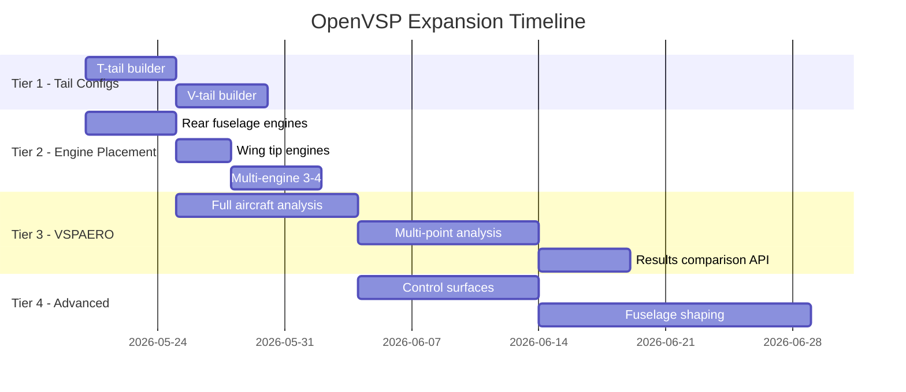
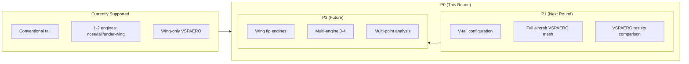

# OpenVSP Capability Roadmap


```mermaid
gantt
    title OpenVSP Expansion Timeline
    dateFormat YYYY-MM-DD
    section Tier 1 - Tail Configs
    T-tail builder              :t1a, 2026-05-20, 5d
    V-tail builder              :t1b, after t1a, 5d
    section Tier 2 - Engine Placement
    Rear fuselage engines       :t2a, 2026-05-20, 5d
    Wing tip engines            :t2b, after t2a, 3d
    Multi-engine 3-4            :t2c, after t2b, 5d
    section Tier 3 - VSPAERO
    Full aircraft analysis      :t3a, after t1a, 10d
    Multi-point analysis        :t3b, after t3a, 10d
    Results comparison API      :t3c, after t3b, 5d
    section Tier 4 - Advanced
    Control surfaces            :t4a, after t3a, 10d
    Fuselage shaping            :t4b, after t4a, 15d
```

## Current vs Planned


```mermaid
flowchart LR
    subgraph Current["Currently Supported"]
        C1[Conventional tail]
        C2[1-2 engines: nose/tail/under-wing]
        C3[Wing-only VSPAERO]
    end

    subgraph P0["P0 (This Round)"]
        P1[T-tail configuration]
        P2[rear_fuselage engine position]
    end

    subgraph P1["P1 (Next Round)"]
        N1[V-tail configuration]
        N2[Full aircraft VSPAERO mesh]
        N3[VSPAERO results comparison]
    end

    subgraph P2["P2 (Future)"]
        F1[Wing tip engines]
        F2[Multi-engine 3-4]
        F3[Multi-point analysis]
    end

    Current --> P0 --> P1 --> P2
```

## Rendering

```bash
npx @mermaid-js/mermaid-cli -i docs/architecture/openvsp-roadmap.md -o docs/architecture/openvsp-roadmap.png
```
