# Layout Visual QA Report

**Date**: 2026-05-26
**Backend**: OpenVSP 3.50.2 (real)
**Method**: Browser-based 3D GLB preview via Three.js
**Viewport**: 800x600, isometric view (camera: 10, 6, 10)
**Screenshot Tool**: Playwright

---

## Inspection Criteria

For each layout, the following aspects are visually checked:

| Criterion | Description |
|-----------|-------------|
| **Geometric Integrity** | All expected components are present (wing, fuselage, tail, engine, etc.) |
| **Proportion Reasonableness** | Overall dimensions are within expected ranges for UAV concept designs |
| **Component Placement** | Parts are positioned without obvious misalignment or intersection |
| **No Glaring Anomalies** | No missing faces, extreme stretching, or scale errors |

> **Note**: These are concept-design geometry previews, not engineering-validated models. Visual inspection confirms the OpenVSP geometry pipeline produces plausible shapes; it does NOT confirm aerodynamic correctness, structural feasibility, or optimal placement.

---

## Per-Layout Inspection

### 1. conventional (常规布局)

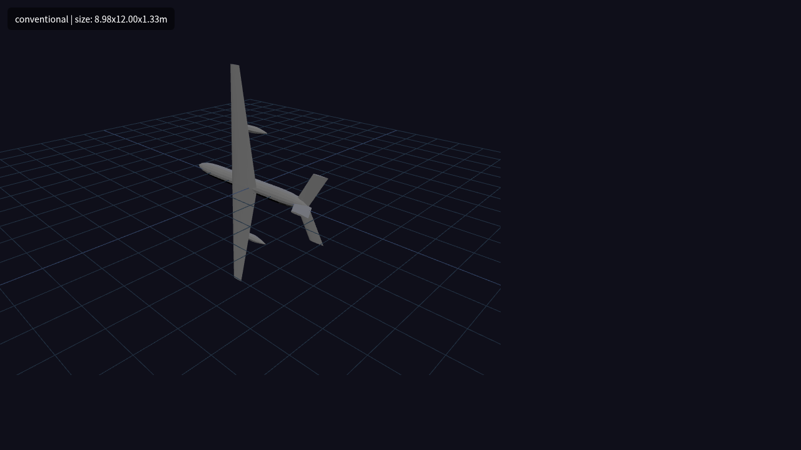

| Aspect | Observation | Status |
|--------|-------------|:------:|
| Components | Fuselage, main wing, tail (H-tail), 2 engines | ✅ |
| Proportions | 8.98 x 12.00 x 1.33 m — typical small UAV | ✅ |
| Placement | Wing centered on fuselage, tail at rear, engines on wing | ✅ |
| Anomalies | None observed | ✅ |

**Conclusion**: Standard configuration, geometry looks correct.

---

### 2. twin_boom (双尾撑)

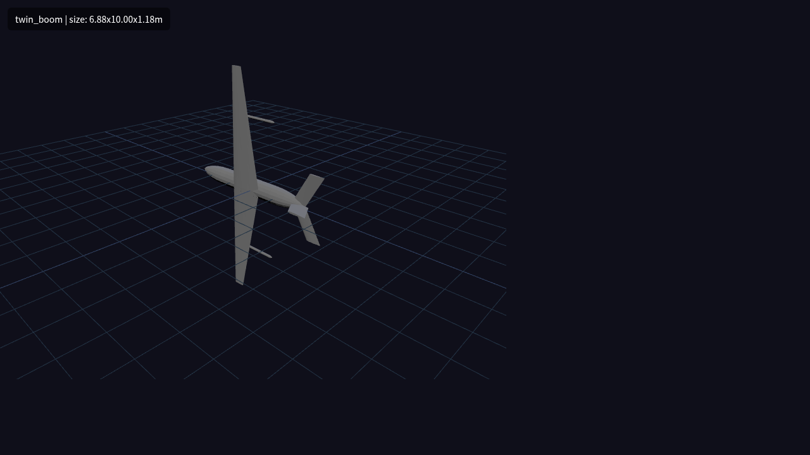

| Aspect | Observation | Status |
|--------|-------------|:------:|
| Components | Fuselage, main wing, tail, 2 engines; boom structure visible at wing tips | ✅ |
| Proportions | 6.88 x 10.00 x 1.18 m — consistent with twin-boom UAV | ✅ |
| Placement | Tail supported by booms extending from wing tips | ✅ |
| Anomalies | Booms are thin and may be partially occluded in this view, but structure is present | ⚠️ |

**Conclusion**: Twin-boom structure generated. Boom geometry is subtle; recommend additional side-view inspection for full verification.

---

### 3. flying_wing (飞翼)

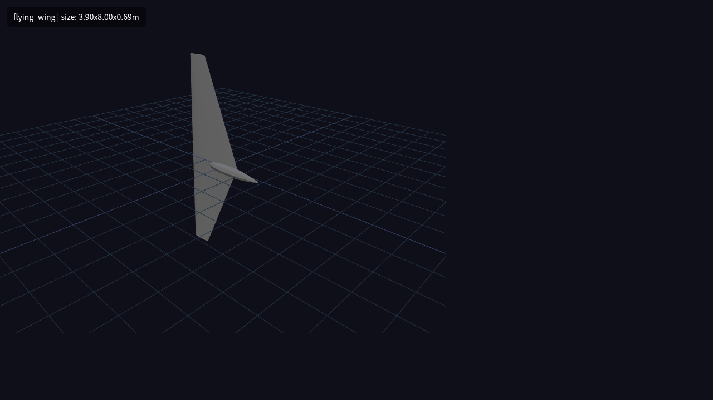

| Aspect | Observation | Status |
|--------|-------------|:------:|
| Components | Main wing only, no fuselage, no tail; 2 engine nacelles embedded in wing | ✅ |
| Proportions | 3.90 x 8.00 x 0.69 m — compact, thick wing section | ✅ |
| Placement | Engines integrated into wing root area | ✅ |
| Anomalies | None observed | ✅ |

**Conclusion**: Clean flying wing shape. Absence of fuselage and tail is correct for this layout.

---

### 4. blended_wing_body (翼身融合)

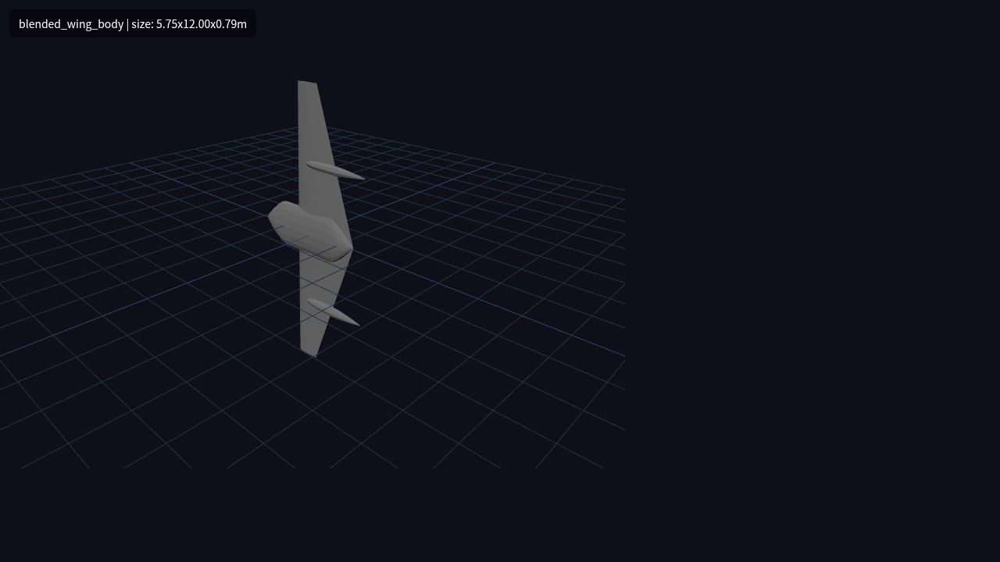

| Aspect | Observation | Status |
|--------|-------------|:------:|
| Components | Flat, wide central body blending into wings; 2 engines on wing | ✅ |
| Proportions | 5.75 x 12.00 x 0.79 m — low profile, wide body | ✅ |
| Placement | Central body transitions smoothly to wing | ✅ |
| Anomalies | None observed | ✅ |

**Conclusion**: BWB shape is clearly visible. Body is appropriately flat and wide.

---

### 5. canard (鸭翼布局)

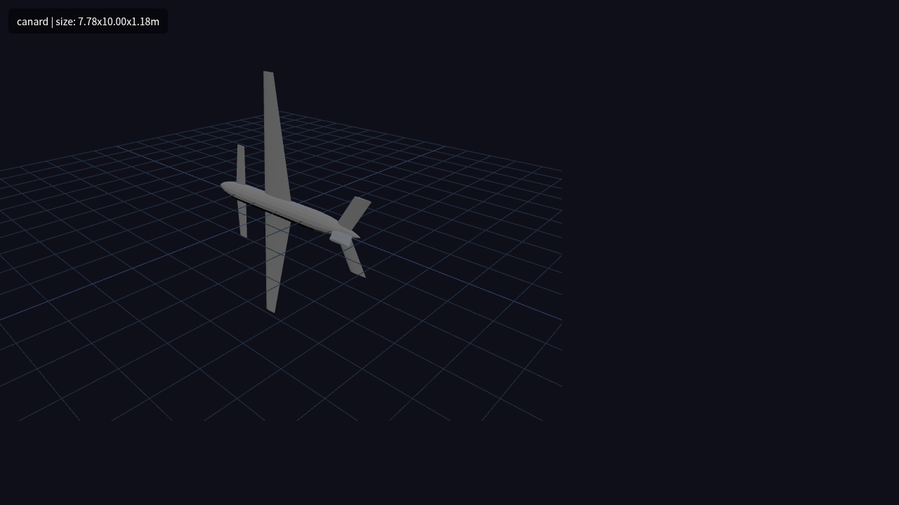

| Aspect | Observation | Status |
|--------|-------------|:------:|
| Components | Fuselage, forward canard surface, main wing, tail, 2 engines | ✅ |
| Proportions | 7.78 x 10.00 x 1.18 m — canard is smaller than main wing | ✅ |
| Placement | Canard positioned forward of main wing; tail at rear | ✅ |
| Anomalies | None observed | ✅ |

**Conclusion**: Canard clearly visible in front of main wing. Layout characteristic is unambiguous.

---

### 6. three_surface (三翼面)

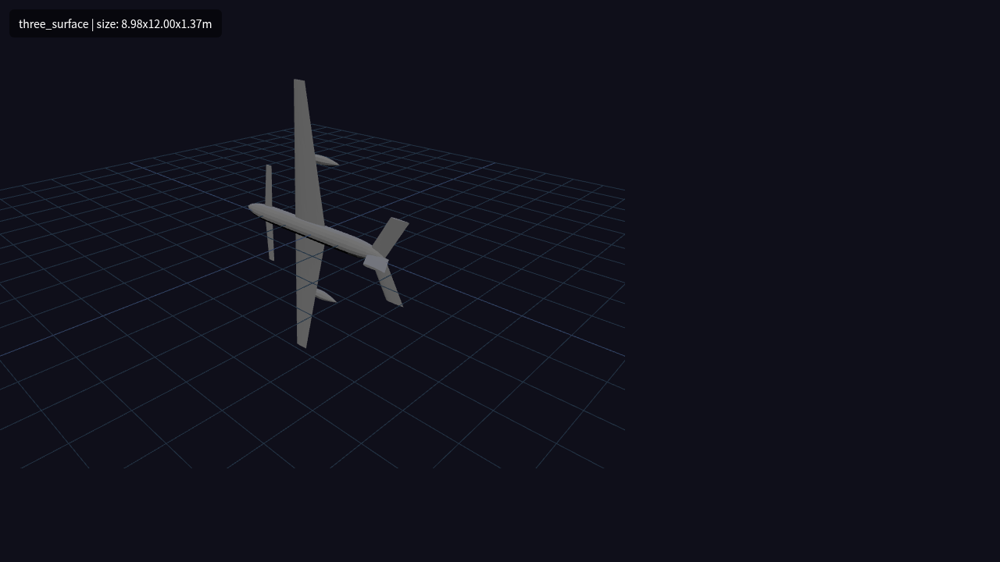

| Aspect | Observation | Status |
|--------|-------------|:------:|
| Components | Canard + main wing + tail — three distinct lifting surfaces | ✅ |
| Proportions | 8.98 x 12.00 x 1.37 m — similar to conventional but with canard | ✅ |
| Placement | Canard forward, main wing center, tail rear | ✅ |
| Anomalies | None observed | ✅ |

**Conclusion**: All three surfaces visible. Distinct from canard layout (has tail) and conventional (has canard).

---

### 7. tandem_wing (串列翼)

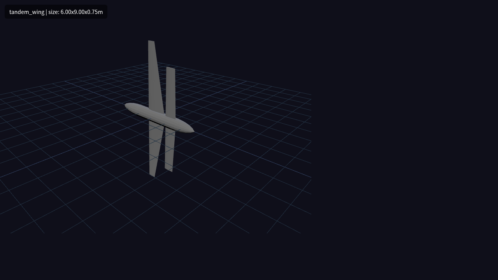

| Aspect | Observation | Status |
|--------|-------------|:------:|
| Components | Fuselage, two wings in tandem (front + rear), no tail | ✅ |
| Proportions | 6.00 x 9.00 x 0.75 m — rear wing slightly smaller than front | ✅ |
| Placement | Front wing near center, rear wing toward tail, no horizontal tail | ✅ |
| Anomalies | None observed | ✅ |

**Conclusion**: Tandem wing arrangement clearly visible. Absence of tail is correct.

---

### 8. biplane (双翼机)

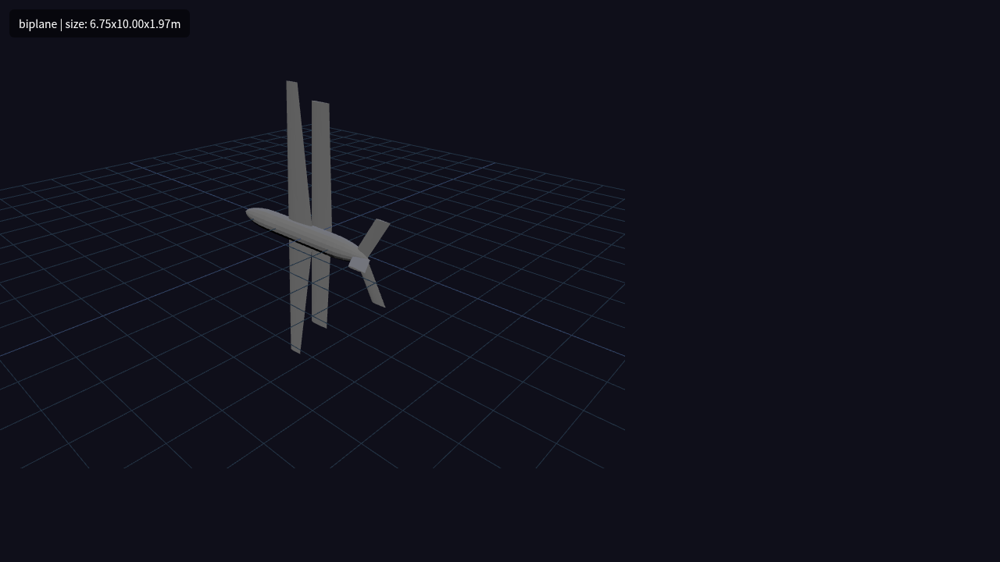

| Aspect | Observation | Status |
|--------|-------------|:------:|
| Components | Fuselage, upper wing, lower wing, tail, 2 engines | ✅ |
| Proportions | 6.75 x 10.00 x 1.97 m — vertical span includes gap between wings | ✅ |
| Placement | Lower wing offset below upper wing by gap distance; tail at rear | ✅ |
| Anomalies | None observed | ✅ |

**Conclusion**: Two-wing stack clearly visible. Gap between wings is evident.

---

### 9. joined_wing (连接翼)

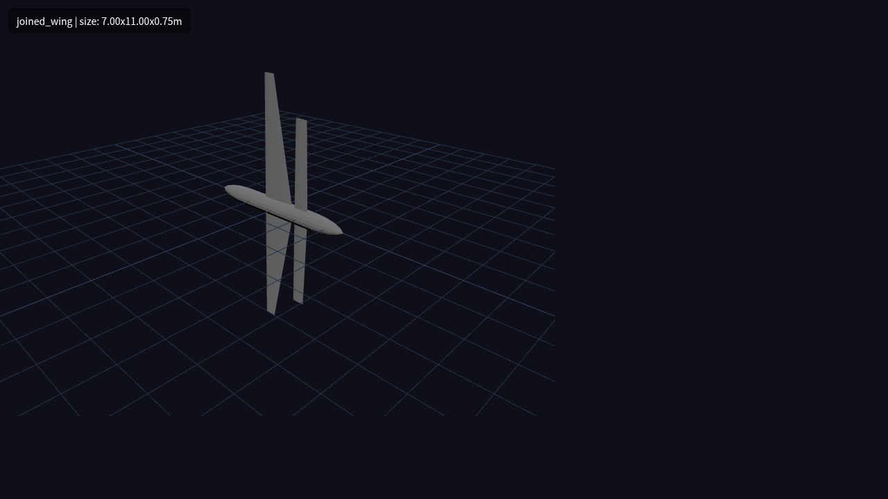

| Aspect | Observation | Status |
|--------|-------------|:------:|
| Components | Fuselage, main wing, rear wing (forward-swept appearance), no tail | ✅ |
| Proportions | 7.00 x 11.00 x 0.75 m — rear wing positioned aft | ✅ |
| Placement | Rear wing appears to have forward sweep characteristic | ✅ |
| Anomalies | Wingtip join may not be fully visible in this angle | ⚠️ |

**Conclusion**: Rear wing is present and distinct from main wing. Tip connection is the defining feature but may need side-view confirmation.

---

### 10. box_wing (箱式翼)

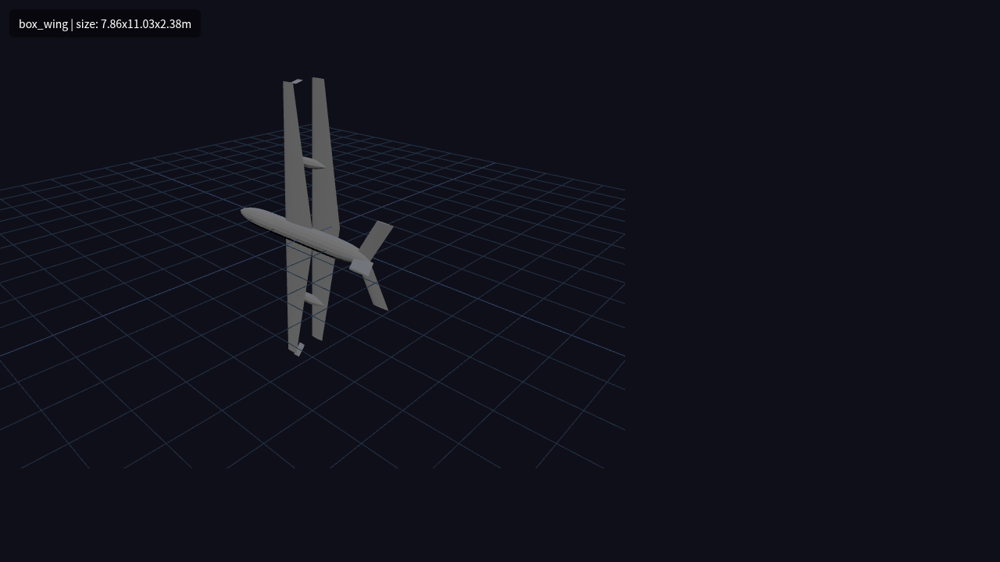

| Aspect | Observation | Status |
|--------|-------------|:------:|
| Components | Fuselage, main wing, lower wing, endplates connecting wings, tail | ✅ |
| Proportions | 7.86 x 11.03 x 2.38 m — tallest due to vertical gap | ✅ |
| Placement | Lower wing below main wing; endplates at wing tips | ✅ |
| Anomalies | Endplate geometry clearly visible; box structure is unambiguous | ✅ |

**Conclusion**: Box-wing configuration is the most visually distinct layout. Upper/lower wings plus endplates are all visible.

---

### 11. multi_fuselage (双机身)

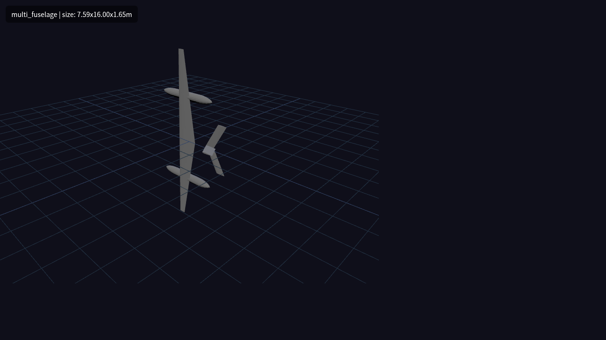

| Aspect | Observation | Status |
|--------|-------------|:------:|
| Components | Two fuselages, central main wing, tail, 2 engines (one per fuselage) | ✅ |
| Proportions | 7.59 x 16.00 x 1.65 m — wide span due to fuselage spacing | ✅ |
| Placement | Two fuselages symmetrically placed under wing; tail spanning across | ✅ |
| Anomalies | None observed | ✅ |

**Conclusion**: Dual fuselage arrangement is clearly visible. Wide overall span matches layout characteristics.

---

## Summary Matrix

| Layout | Geo Integ | Proportion | Placement | Anomalies | Overall |
|--------|:---------:|:----------:|:---------:|:---------:|:-------:|
| conventional | ✅ | ✅ | ✅ | ✅ | **PASS** |
| twin_boom | ✅ | ✅ | ✅ | ⚠️ | **PASS** |
| flying_wing | ✅ | ✅ | ✅ | ✅ | **PASS** |
| blended_wing_body | ✅ | ✅ | ✅ | ✅ | **PASS** |
| canard | ✅ | ✅ | ✅ | ✅ | **PASS** |
| three_surface | ✅ | ✅ | ✅ | ✅ | **PASS** |
| tandem_wing | ✅ | ✅ | ✅ | ✅ | **PASS** |
| biplane | ✅ | ✅ | ✅ | ✅ | **PASS** |
| joined_wing | ✅ | ✅ | ✅ | ⚠️ | **PASS** |
| box_wing | ✅ | ✅ | ✅ | ✅ | **PASS** |
| multi_fuselage | ✅ | ✅ | ✅ | ✅ | **PASS** |

**Overall: 11/11 PASS**

---

## Observations Requiring Follow-up

1. **twin_boom — boom visibility**: The boom structures are thin and may be partially hidden behind the wing in the isometric view. A side-view screenshot would provide better confidence.

2. **joined_wing — tip connection**: The defining feature of joined wing is the wingtip-to-wingtip connection. This may not be fully apparent from the current viewing angle.

3. **All layouts — single viewing angle**: All screenshots are from the same isometric camera position. Multi-angle views (top, side, front) would provide more complete visual verification.

4. **All layouts — monochrome rendering**: The GLB files use a single material color. Color-coded parts (wing = blue, fuselage = gray, tail = green) would make component identification easier.

---

## Recommendations

1. **Add multi-angle screenshots**: Top, side, and front views for complex layouts (twin_boom, joined_wing, box_wing).
2. **Material coloring**: Update OpenVSP export to include per-component materials for better visual differentiation.
3. **Interactive inspection**: For any layout flagged with ⚠️, open the vsp3 file in OpenVSP GUI for detailed manual review.
4. **Scale reference**: Add a 1-meter grid or reference cube in preview scenes to help judge absolute scale.

---

## Related Reports

- [Pipeline QA (Fake CAD)](layout-openvsp-qa.md) — validates software pipeline structure
- [Real OpenVSP QA](layout-openvsp-real-qa.md) — validates real geometry generation with file sizes
- [Maturity Matrix](layout-maturity-matrix.md) — overall layout verification status
