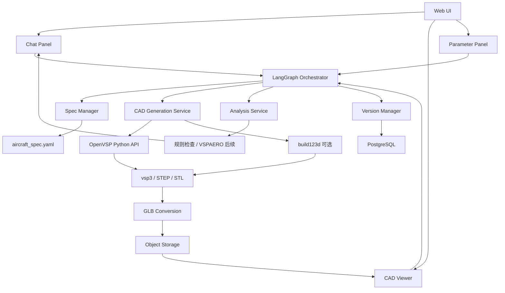
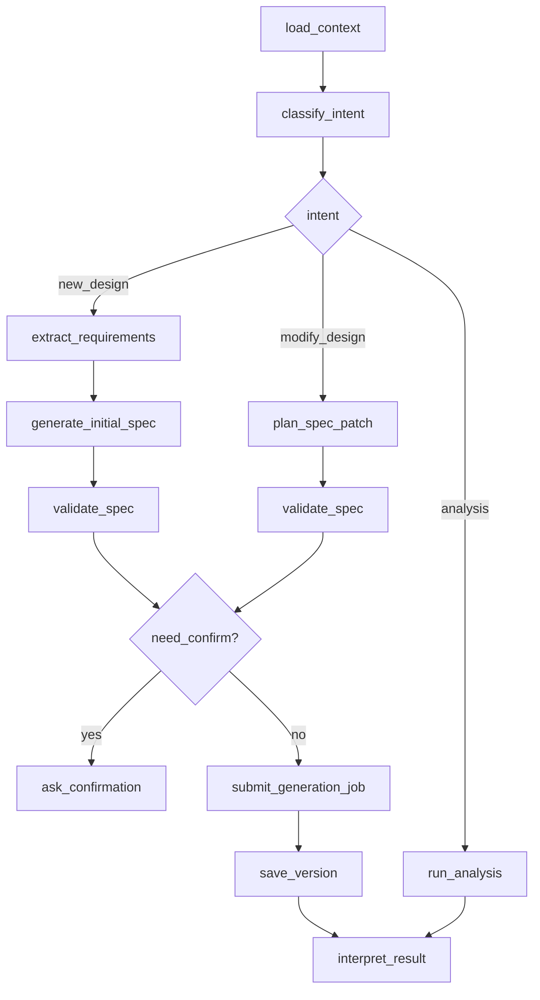
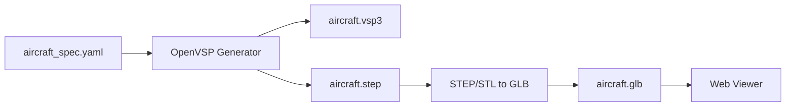
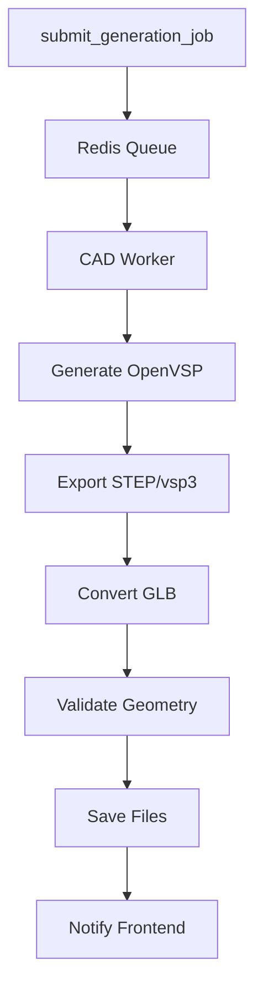

# 自然语言飞机概念设计工作台 PRD 与详细设计方案

> 文档目标：沉淀前期关于 `text-to-cad`、CADAM、OpenVSP、CAD Explorer、LLM 对话、LangGraph 编排与准确性控制的讨论，形成可交给开发团队或本地 Coding Agent 执行的产品需求文档与详细设计方案。  
> 建议项目名：`AeroSpec Agent` / `自然语言飞机概念设计工作台`  
> MVP 主线：自然语言描述飞机需求 → 生成 `aircraft_spec.yaml` → 调用 OpenVSP/build123d 生成 CAD → Web UI 预览 → 用户通过对话和选中对象继续修改 → 保存版本和分析结果。

---

## 1. 项目背景与目标

### 1.1 背景

当前已有一些开源项目展示了自然语言驱动 CAD 的不同实现路径：

- `text-to-cad`：偏工程化 CAD Agent 工作流，强调通过 Coding Agent 生成参数化 CAD 源码，输出 STEP、STL、GLB/topology，并通过 CAD Explorer 做模型检查和 `@cad[...]` 引用。
- `CADAM`：偏 Web 产品形态，强调自然语言生成 OpenSCAD、参数滑块、浏览器内实时预览，但更适合 3D 打印小模型，不适合作为飞机总体设计后端。
- `OpenVSP`：适合飞机总体外形参数化建模，可生成机身、机翼、尾翼、吊舱等航空几何，并可接入 VSPAERO 等分析流程。
- `LangGraph`：适合长流程、多状态、多工具调用、人机确认的智能体编排，可用于自然语言设计、CAD 生成、分析校核、版本保存等流程控制。

本项目希望将这些思路收敛为一个面向飞机/无人机概念设计的原型系统。

### 1.2 项目目标

构建一个支持自然语言驱动的飞机概念设计工作台，使用户可以：

1. 用自然语言描述飞机/无人机设计需求；
2. 系统自动生成结构化 `aircraft_spec.yaml`；
3. 基于 `aircraft_spec.yaml` 调用 OpenVSP 生成飞机主外形；
4. 导出 `vsp3`、`STEP`、`GLB` 等文件；
5. 在 Web UI 中实时预览三维模型；
6. 通过对话、参数面板和模型选中对象继续修改设计；
7. 保存设计版本、生成记录和分析检查结果。

### 1.3 MVP 核心闭环

```text
自然语言描述
→ aircraft_spec.yaml
→ OpenVSP 生成
→ GLB Web 预览
→ 对话修改参数
→ 重新生成
→ 保存版本
```

---

## 2. 产品定位

### 2.1 产品定义

本产品是一个面向飞机/无人机早期概念设计的智能工作台，不是传统 CAD 软件，也不是完整适航级总体设计平台。

它的核心形态是：

```text
LLM 对话入口
+ aircraft_spec 参数化设计状态
+ OpenVSP/build123d CAD 生成
+ Web 三维预览
+ 多轮修改与版本管理
```

### 2.2 目标用户

| 用户类型 | 核心需求 |
|---|---|
| 飞机总体设计人员 | 快速把任务需求转成初始外形方案 |
| 科研人员 | 探索 LLM + CAD + OpenVSP 的生成式设计流程 |
| 工程助理/研究生 | 快速生成概念模型、参数表和方案记录 |
| 项目汇报人员 | 快速得到可视化外形、参数说明和设计迭代记录 |

### 2.3 产品边界

第一版只做固定翼飞机/无人机概念外形设计，不承诺完整适航设计、详细结构强度、高精度 CFD 或生产级 CAD 装配。

---

## 3. MVP 范围

### 3.1 必须支持

1. 自然语言生成 `aircraft_spec.yaml`；
2. `aircraft_spec.yaml` 校验与参数补全；
3. OpenVSP 生成飞机主外形；
4. 导出 `vsp3`、`STEP`、`GLB`；
5. Web UI 显示 GLB；
6. 对话式修改参数；
7. 参数面板手动修改；
8. 版本保存；
9. 任务状态显示；
10. 基础几何/规则检查。

### 3.2 MVP 支持布局

```text
固定翼无人机
常规布局
上单翼 / 中单翼 / 下单翼
常规尾翼
单发 / 双发
翼下吊舱 / 机头 / 机尾推进
```

第一版建议优先实现：

```text
双发、上单翼、常规尾翼固定翼无人机
```

### 3.3 MVP 暂不支持

```text
完整适航设计
高精度 CFD
详细结构强度
复杂翼身融合
真实控制面细节建模
复杂曲面连续性优化
生产级 CAD 装配
```

---

## 4. 典型使用场景

### 4.1 自然语言生成初始飞机

用户输入：

```text
设计一架翼展 12 米、双发、上单翼、常规尾翼的固定翼无人机。
要求巡航速度约 120km/h，载荷 30kg，偏长航时。
```

系统输出：

```text
aircraft_spec.yaml
aircraft.vsp3
aircraft.step
aircraft.glb
初步参数摘要
Web 三维预览
```

### 4.2 对话式修改

用户继续输入：

```text
把翼展增加到 14 米，机身保持不变。
```

系统应：

```text
修改 aircraft_spec.yaml
重新调用 OpenVSP
重新生成 GLB/STEP
刷新 Web 预览
解释修改影响
保存新版本
```

### 4.3 点击模型后修改

用户在 3D 视图中点击右侧发动机吊舱，系统生成引用：

```text
@cad[aircraft#right_engine]
```

用户输入：

```text
把这个发动机向外侧移动 0.5 米。
```

系统识别“这个”为右侧发动机，并修改对应参数。

### 4.4 分析检查与建议

用户输入：

```text
检查一下当前方案是否适合长航时。
```

系统运行规则检查，后续可接 VSPAERO，输出：

```text
翼展、翼面积、展弦比、翼载荷、尾容量等检查结果
潜在问题
建议修改方案
```

---

## 5. 核心设计原则

### 5.1 `aircraft_spec.yaml` 是唯一权威设计状态

```text
aircraft_spec.yaml 是主数据
OpenVSP Python 是生成物
vsp3 / STEP / GLB 是生成物
```

不要让 LLM 直接修改 STEP 或 GLB。

### 5.2 LLM 不直接写最终 OpenVSP 代码

LLM 只负责：

```text
理解自然语言
生成结构化参数
规划参数修改
解释结果
```

OpenVSP Python 代码由确定性模板生成。

### 5.3 Web 前端只负责预览和交互，不直接编辑 CAD

前端展示：

```text
GLB / glTF
```

后端保存：

```text
aircraft_spec.yaml
aircraft.vsp3
aircraft.step
build123d/openvsp 生成脚本
```

### 5.4 所有推断参数必须显式标记

每个关键参数需要记录：

```text
value
unit
source: user / inferred / rule_default / system_default
confidence
reason
```

### 5.5 生成后必须反查验证

代码运行成功不代表模型正确。必须检查：

```text
OpenVSP API 是否报错
关键参数是否写入成功
几何包围盒是否符合翼展/机身长
发动机数量是否正确
布局是否符合 spec
```

---

## 6. 总体系统架构



---

## 7. 技术栈建议

### 7.1 前端

```text
Next.js / React
TypeScript
Tailwind CSS
shadcn/ui
Three.js 或 React Three Fiber
Vercel AI SDK 或自研 SSE
Zustand
React Hook Form + Zod
Monaco Editor
```

### 7.2 后端

```text
FastAPI
Pydantic v2
PostgreSQL
Redis
Celery / RQ / Dramatiq
MinIO / S3
OpenVSP Python API
build123d / OCP
trimesh / meshio
```

### 7.3 智能编排

```text
LangGraph Python
```

### 7.4 CAD/CAE

```text
OpenVSP：飞机总体外形
build123d：结构/机械细节，后续接入
VSPAERO：气动分析，后续接入
XFOIL / AVL：可作为后续轻量分析工具
```

---

## 8. 前端功能设计

### 8.1 页面布局

建议三栏布局：

```text
┌──────────────────────────────────────────────┐
│ 顶部：项目名 / 当前版本 / 生成状态 / 导出按钮 │
├───────────────┬──────────────────┬───────────┤
│ 左侧：对话区   │ 中间：3D CAD 预览 │ 右侧：参数区 │
│ Chat Panel    │ CAD Viewer        │ Spec Panel │
├───────────────┴──────────────────┴───────────┤
│ 底部：任务日志 / 分析结果 / 版本历史           │
└──────────────────────────────────────────────┘
```

### 8.2 Chat Panel

功能：

```text
自然语言输入
流式输出
显示工具调用状态
显示生成进度
显示分析解释
支持插入 @cad 引用
```

消息类型：

```text
user_message
assistant_message
tool_call
tool_result
generation_status
analysis_summary
```

### 8.3 CAD Viewer

第一版支持：

```text
加载 GLB
旋转 / 缩放 / 平移
部件高亮
点击部件
复制部件引用
刷新模型
截图
```

后续增强：

```text
面选择
边选择
@cad[...] 精准引用
STEP_topology 映射
装配树
剖切视图
```

### 8.4 Parameter Panel

从 `aircraft_spec.yaml` 或 JSON Schema 自动生成参数面板。

分组：

```text
任务需求
机身
机翼
尾翼
发动机
起落架
导出与分析
```

每个参数显示：

```text
名称
当前值
单位
来源
置信度
是否用户明确给出
是否系统推断
```

### 8.5 Version Panel

显示：

```text
v1 初始方案
v2 翼展修改
v3 发动机外移
v4 运行分析后调整尾翼
```

支持：

```text
查看历史版本
恢复版本
对比参数变化
下载文件
```

---

## 9. LangGraph 编排设计

### 9.1 Graph 状态

```python
class DesignAgentState(TypedDict):
    conversation_id: str
    design_id: str
    user_message: str
    selected_refs: list[str]

    current_spec: dict
    intent: str
    extracted_requirements: dict
    planned_patch: list[dict]

    requires_confirmation: bool
    confirmation_message: str | None

    generation_job_id: str | None
    generation_result: dict | None

    analysis_result: dict | None
    reply: str
```

### 9.2 核心节点

```text
load_context
classify_intent
extract_requirements
generate_initial_spec
plan_spec_patch
validate_spec
ask_confirmation
apply_spec_patch
submit_generation_job
check_generation_result
run_analysis
interpret_result
save_version
```

### 9.3 MVP Graph



### 9.4 Intent 类型

```text
new_design：新建设计
modify_design：修改当前设计
analyze_design：运行分析或规则检查
explain_design：解释当前方案
export_files：导出文件
compare_versions：版本对比
```

---

## 10. `aircraft_spec.yaml` 设计

### 10.1 示例结构

```yaml
schema_version: "0.1"

aircraft:
  name: twin_engine_uav
  type: fixed_wing_uav
  layout: conventional

mission:
  cruise_speed:
    value: 120
    unit: km/h
    source: user
    confidence: 1.0
  payload:
    value: 30
    unit: kg
    source: user
    confidence: 1.0
  priority:
    value: endurance
    source: user
    confidence: 0.9

fuselage:
  length:
    value: 7.0
    unit: m
    source: rule_default
    confidence: 0.7
  max_diameter:
    value: 0.75
    unit: m
    source: rule_default
    confidence: 0.7

wing:
  position:
    value: high
    source: user
    confidence: 1.0
  span:
    value: 12.0
    unit: m
    source: user
    confidence: 1.0
  root_chord:
    value: 1.2
    unit: m
    source: rule_default
    confidence: 0.75
  tip_chord:
    value: 0.6
    unit: m
    source: rule_default
    confidence: 0.75
  sweep:
    value: 5
    unit: deg
    source: rule_default
    confidence: 0.7
  dihedral:
    value: 3
    unit: deg
    source: rule_default
    confidence: 0.7
  airfoil:
    value: NACA4412
    source: system_default
    confidence: 0.6

tail:
  type:
    value: conventional
    source: user
    confidence: 1.0

engine:
  count:
    value: 2
    source: user
    confidence: 1.0
  position:
    value: under_wing
    source: inferred
    confidence: 0.75
```

### 10.2 参数来源类型

| source | 含义 |
|---|---|
| user | 用户明确给出 |
| inferred | LLM 根据上下文推断 |
| rule_default | 规则库补全 |
| system_default | 系统默认值 |

低置信度或关键推断参数需要用户确认。

---

## 11. 自然语言到 `aircraft_spec.yaml` 的准确性控制

### 11.1 处理流程

```text
用户自然语言
→ LLM 结构化抽取
→ Pydantic 校验
→ 单位归一化
→ 规则补全
→ 冲突检查
→ 置信度判断
→ 用户确认
→ 生成 aircraft_spec.yaml
```

### 11.2 禁止 LLM 直接自由写 YAML

推荐流程：

```text
LLM 输出 JSON structured output
→ Pydantic validate
→ dump YAML
```

### 11.3 必须保留 `source_text`

每个用户明确参数都要记录来源句子：

```json
{
  "path": "wing.span.value",
  "value": 12,
  "unit": "m",
  "source": "user",
  "source_text": "翼展 12 米",
  "confidence": 1.0
}
```

### 11.4 需要人机确认的情况

```text
关键参数缺失
推断置信度低于 0.7
参数冲突
修改会显著影响设计性能
用户描述模糊
```

---

## 12. `aircraft_spec.yaml` 到 OpenVSP 的准确性控制

### 12.1 核心原则

不要让 LLM 直接写 OpenVSP Python。

正确流程：

```text
aircraft_spec.yaml
→ Pydantic 校验
→ 单位转换
→ OpenVSP 参数映射表
→ 固定模板生成 Python
→ 执行 OpenVSP
→ 错误检查
→ 几何反查
```

### 12.2 OpenVSP 参数映射表示例

```yaml
wing:
  root_chord:
    geom_type: WING
    parm_name: Root_Chord
    group_name: XSec_1
    unit: m

  tip_chord:
    geom_type: WING
    parm_name: Tip_Chord
    group_name: XSec_1
    unit: m

  sweep:
    geom_type: WING
    parm_name: Sweep
    group_name: XSec_1
    unit: deg

  dihedral:
    geom_type: WING
    parm_name: Dihedral
    group_name: XSec_1
    unit: deg
```

### 12.3 OpenVSP 生成器结构

```text
openvsp_generator/
  schema.py
  units.py
  mapper.py
  generate_aircraft.py
  create_fuselage.py
  create_wing.py
  create_tail.py
  create_engine.py
  export_files.py
  verify_model.py
```

### 12.4 生成后检查

```text
OpenVSP API error 检查
vsp3 是否写出
STEP 是否导出
GLB 是否生成
翼展是否符合 spec
机身长度是否符合 spec
发动机数量是否符合 spec
尾翼类型是否符合 spec
```

---

## 13. CAD 生成与 Web 预览设计

### 13.1 文件体系

每个版本保存：

```text
aircraft_spec.yaml
aircraft.py
aircraft.vsp3
aircraft.step
aircraft.stl
aircraft.glb
thumbnail.png
generation_log.json
validation_report.json
analysis_report.json
```

### 13.2 预览格式

前端只加载：

```text
GLB / glTF
```

工程交付文件：

```text
STEP
vsp3
```

### 13.3 生成流程



---

## 14. 数据库设计

### 14.1 核心表

```text
users
conversations
messages
designs
design_versions
design_files
generation_jobs
analysis_results
cad_refs
```

### 14.2 designs

```sql
CREATE TABLE designs (
  id UUID PRIMARY KEY,
  user_id UUID,
  title TEXT NOT NULL,
  current_version_id UUID,
  created_at TIMESTAMP,
  updated_at TIMESTAMP
);
```

### 14.3 design_versions

```sql
CREATE TABLE design_versions (
  id UUID PRIMARY KEY,
  design_id UUID NOT NULL,
  version_no INTEGER NOT NULL,
  spec_json JSONB NOT NULL,
  status TEXT NOT NULL,
  created_from_message_id UUID,
  created_at TIMESTAMP
);
```

### 14.4 design_files

```sql
CREATE TABLE design_files (
  id UUID PRIMARY KEY,
  design_version_id UUID NOT NULL,
  file_type TEXT NOT NULL,
  file_path TEXT NOT NULL,
  file_hash TEXT,
  created_at TIMESTAMP
);
```

### 14.5 generation_jobs

```sql
CREATE TABLE generation_jobs (
  id UUID PRIMARY KEY,
  design_version_id UUID NOT NULL,
  status TEXT NOT NULL,
  progress INTEGER DEFAULT 0,
  current_step TEXT,
  error_message TEXT,
  created_at TIMESTAMP,
  updated_at TIMESTAMP
);
```

---

## 15. API 设计

### 15.1 对话接口

```http
POST /api/chat
```

请求：

```json
{
  "conversation_id": "xxx",
  "design_id": "xxx",
  "message": "把翼展增加到14米",
  "selected_refs": ["@cad[aircraft#right_engine]"]
}
```

返回：SSE 流式事件。

### 15.2 设计版本接口

```http
GET /api/designs/{design_id}
GET /api/designs/{design_id}/versions
GET /api/designs/{design_id}/versions/{version_id}
POST /api/designs/{design_id}/versions/{version_id}/restore
```

### 15.3 参数修改接口

```http
PATCH /api/designs/{design_id}/spec
```

请求：

```json
{
  "changes": [
    {
      "path": "wing.span.value",
      "value": 14,
      "unit": "m"
    }
  ]
}
```

### 15.4 生成接口

```http
POST /api/designs/{design_id}/generate
GET /api/jobs/{job_id}
GET /api/jobs/{job_id}/events
```

### 15.5 文件接口

```http
GET /api/designs/{design_id}/files
GET /api/files/{file_id}/download
```

---

## 16. 任务队列设计

CAD 生成不要阻塞对话接口。

### 16.1 任务状态

```text
queued
running
generating_vsp
exporting_step
converting_glb
validating
ready
failed
```

### 16.2 任务流程



---

## 17. 分析与规则检查设计

### 17.1 MVP 规则检查

第一版可实现轻量规则：

```text
翼展范围检查
机身长度范围检查
翼展/机身长度比例检查
展弦比估算
发动机数量与布局检查
左右发动机对称性检查
上单翼/中单翼/下单翼位置检查
尾翼类型检查
```

### 17.2 后续分析接口

后续接入：

```text
VSPAERO
AVL
XFOIL
结构/重量估算模型
代理模型
多目标优化
```

---

## 18. 验收标准

### 18.1 自然语言生成验收

输入：

```text
生成一架翼展12米、双发、上单翼、常规尾翼无人机。
```

系统必须生成：

```text
aircraft_spec.yaml
vsp3
STEP
GLB
Web 预览
```

并且 spec 中：

```text
wing.span = 12m
engine.count = 2
wing.position = high
tail.type = conventional
```

### 18.2 对话修改验收

输入：

```text
把翼展增加到14米。
```

系统必须：

```text
生成新版本
spec 中 wing.span = 14m
重新生成 GLB
前端模型刷新
对话解释修改结果
```

### 18.3 参数面板验收

用户修改参数后：

```text
spec 更新
生成任务创建
模型刷新
版本保存
```

### 18.4 文件导出验收

每个版本可下载：

```text
aircraft_spec.yaml
aircraft.vsp3
aircraft.step
aircraft.glb
```

### 18.5 准确性验收

系统必须输出 validation report：

```json
{
  "wing.span": {
    "expected": 12,
    "actual": 12.01,
    "status": "pass"
  },
  "engine.count": {
    "expected": 2,
    "actual": 2,
    "status": "pass"
  }
}
```

---

## 19. 开发阶段规划

### 阶段 0：技术验证

目标：

```text
手写 aircraft_spec.yaml
调用 OpenVSP 生成 vsp3/STEP
转换 GLB
前端加载 GLB
```

产物：

```text
openvsp_generator 原型
Web GLB Viewer 原型
```

### 阶段 1：MVP 原型

目标：

```text
自然语言 → aircraft_spec.yaml → OpenVSP → GLB → Web 预览
```

功能：

```text
对话输入
初始 spec 生成
参数面板
生成任务
版本保存
GLB 预览
```

### 阶段 2：对话式修改

目标：

```text
多轮对话修改参数
```

功能：

```text
LangGraph
spec patch
重新生成
修改解释
版本历史
```

### 阶段 3：CAD 引用

目标：

```text
点击模型部件后对话修改
```

功能：

```text
部件树
部件 ref
点击高亮
selected_refs 进入 LLM 上下文
```

### 阶段 4：分析闭环

目标：

```text
初步设计合理性检查
```

功能：

```text
翼载荷估算
展弦比检查
尾容量估算
发动机位置检查
VSPAERO 接入预研
```

---

## 20. 推荐目录结构

```text
aero-spec-agent/
  apps/
    web/
      src/
        components/
          chat/
          cad-viewer/
          parameter-panel/
          version-panel/
        stores/
        lib/
        app/

  services/
    api/
      app/
        main.py
        routers/
          chat.py
          designs.py
          jobs.py
          files.py
        graph/
          design_graph.py
          nodes/
        schemas/
          aircraft_spec.py
        services/
          spec_manager.py
          version_manager.py

    workers/
      cad_worker/
        openvsp_generator/
          generate_aircraft.py
          create_fuselage.py
          create_wing.py
          create_tail.py
          create_engine.py
          export_files.py
          verify_model.py

      conversion_worker/
        step_to_glb.py
        render_thumbnail.py

      analysis_worker/
        rule_checks.py
        vspaero_runner.py

  packages/
    aircraft-schema/
      aircraft_spec.schema.json
      examples/
        twin_engine_uav.yaml

  infra/
    docker-compose.yml
    nginx/
    postgres/
    minio/
```

---

## 21. Coding Agent 初始任务提示词

```text
我们要实现一个自然语言飞机概念设计原型系统，项目名 aero-spec-agent。

第一阶段目标：
用户输入自然语言或手写 aircraft_spec.yaml，系统生成固定翼无人机 OpenVSP 模型，导出 vsp3、STEP、GLB，并在 Web UI 中展示。

请先实现以下 MVP：

1. 后端使用 FastAPI。
2. 定义 Pydantic v2 aircraft_spec 数据模型。
3. 支持读取 examples/twin_engine_uav.yaml。
4. 实现 openvsp_generator：
   - create_fuselage()
   - create_wing()
   - create_tail()
   - create_engine_nacelles()
   - export_vsp3()
   - export_step()
5. 实现生成任务接口：
   POST /api/designs/{design_id}/generate
   GET /api/jobs/{job_id}
6. 生成文件保存到本地 storage/designs/{design_id}/versions/{version_no}/。
7. 前端使用 Next.js + React + TypeScript + shadcn/ui。
8. 实现三栏布局：
   - 左侧 Chat Panel
   - 中间 GLB Viewer
   - 右侧 Parameter Panel
9. Viewer 第一版只需要加载 GLB 并支持旋转、缩放、平移。
10. 实现 aircraft_spec.yaml 参数面板展示。
11. 每次生成完成后前端刷新 GLB。
12. 不要求第一版接入真实 LLM，但要预留 /api/chat 接口和 LangGraph 目录结构。
```

---

## 22. 最终结论

当前原型应按以下路线落地：

```text
1. aircraft_spec.yaml 作为唯一设计真相
2. LLM 只负责自然语言理解和参数修改规划
3. LangGraph 负责对话、工具调用、任务编排和人机确认
4. OpenVSP 负责飞机总体外形生成
5. build123d 后续负责结构/机械细节
6. 后端生成 STEP/vsp3/GLB
7. Web 前端只展示 GLB 并采集用户选择
8. 所有修改通过 spec patch 进入新版本
9. 生成后通过规则和几何反查验证准确性
```

第一版最小闭环是：

```text
自然语言描述
→ aircraft_spec.yaml
→ OpenVSP 生成
→ GLB Web 预览
→ 对话修改参数
→ 重新生成
→ 保存版本
```

这就是整个系统的 MVP 主线。

